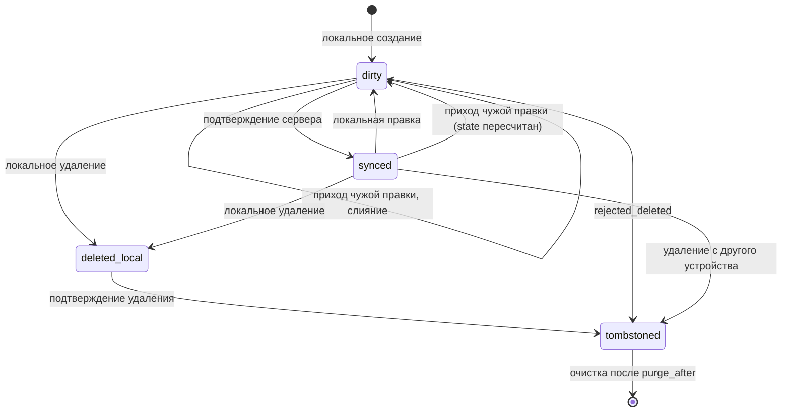

# Модель данных и инварианты

Раздел описывает данные, которыми обмениваются мобильный клиент и сервер при офлайн-работе, и правила, гарантирующие сходимость состояния при параллельных правках одной записи с нескольких устройств одного пользователя.

## 1. Обзор

Модель строится на трёх решениях:

1. **Сервер — единственный источник версии.** Клиент никогда не увеличивает `version`; он лишь сообщает, от какой версии он отталкивался.
2. **Клиент хранит не результат, а намерение.** Локальное состояние — это свёртка: серверный снимок плюс очередь ещё не подтверждённых операций. Материализованная запись производна и всегда может быть пересобрана.
3. **Удаление — поглощающее состояние.** Любое чередование удаления и правок одной записи сходится к удалённому состоянию, независимо от порядка доставки.

## 2. Сущности

### 2.1. Серверные

#### `Record` — запись

| Поле | Тип | Описание |
|---|---|---|
| `id` | UUID v7 | Генерируется клиентом. Иммутабелен. Первичный ключ. |
| `user_id` | UUID | Владелец. Иммутабелен. |
| `type` | enum | Тип сущности предметной области. Иммутабелен. |
| `payload` | JSON object | Плоская карта полей предметной области. |
| `field_meta` | map<string, FieldMeta> | Метаданные авторства по каждому полю `payload`. |
| `version` | int64 ≥ 1 | Монотонный счётчик, +1 на каждую принятую запись. |
| `deleted` | bool | Признак надгробия. |
| `deleted_at` | timestamp \| null | Серверное время удаления. |
| `purge_after` | timestamp \| null | Момент физического удаления надгробия. |
| `created_at` | timestamp | Серверное время первой записи. |
| `updated_at` | timestamp | Серверное время последней принятой записи. |

#### `FieldMeta` — метаданные поля

| Поле | Тип | Описание |
|---|---|---|
| `edited_at` | timestamp | Авторское время правки, снятое на устройстве и скорректированное на оценку смещения часов. |
| `device_id` | UUID | Устройство-автор последнего принятого значения поля. |
| `op_id` | UUID | Операция, установившая значение. |

#### `ChangeLogEntry` — журнал изменений

| Поле | Тип | Описание |
|---|---|---|
| `seq` | int64 | Монотонный номер, уникальный в пределах `user_id`. Курсор синхронизации. |
| `record_id` | UUID | Изменённая запись. |
| `version` | int64 | Версия записи после изменения. |
| `kind` | enum | `create` \| `update` \| `delete` \| `purge`. |
| `origin_device_id` | UUID | Устройство-инициатор (клиент фильтрует собственное эхо). |

#### `AppliedOperation` — журнал идемпотентности

| Поле | Тип | Описание |
|---|---|---|
| `op_id` | UUID | Идентификатор операции клиента. Первичный ключ. |
| `result_version` | int64 | Версия, полученная в результате применения. |
| `outcome` | enum | `applied` \| `merged` \| `rejected_deleted`. |
| `expires_at` | timestamp | Горизонт хранения (≥ максимального окна ретраев). |

#### `Device` — устройство

| Поле | Тип | Описание |
|---|---|---|
| `device_id` | UUID | Идентификатор установки. |
| `user_id` | UUID | Владелец. |
| `last_ack_seq` | int64 | Последний подтверждённый курсор. |
| `last_seen_at` | timestamp | Последний контакт. |

#### `DiscardedEdit` — отклонённая правка

| Поле | Тип | Описание |
|---|---|---|
| `id` | UUID | Ключ. |
| `record_id` | UUID | Запись, которой правка адресовалась. |
| `op_id` | UUID | Отклонённая операция. |
| `patch` | JSON object | Содержимое правки. |
| `reason` | enum | `record_deleted`. |
| `discarded_at` | timestamp | Момент отклонения. |
| `retain_until` | timestamp | Горизонт хранения. |

### 2.2. Клиентские

#### `LocalRecord` — материализованная запись

| Поле | Тип | Описание |
|---|---|---|
| `id` | UUID v7 | Совпадает с `Record.id`. |
| `payload` | JSON object | Результат свёртки: серверный снимок + непринятые операции. |
| `server_payload` | JSON object | Последний известный серверный снимок. |
| `base_version` | int64 ≥ 0 | Версия `server_payload`. `0` — запись ещё не существует на сервере. |
| `state` | enum | `synced` \| `dirty` \| `deleted_local` \| `tombstoned`. |
| `server_deleted` | bool | Сервер сообщил о надгробии. |

#### `Operation` — элемент очереди

| Поле | Тип | Описание |
|---|---|---|
| `op_id` | UUID | Генерируется при постановке в очередь. Иммутабелен. |
| `local_seq` | int64 | Монотонный счётчик устройства. Задаёт порядок очереди. |
| `record_id` | UUID | Целевая запись. |
| `kind` | enum | `create` \| `update` \| `delete`. |
| `base_version` | int64 | Версия, от которой отталкивалась правка. |
| `patch` | map<string, {value, edited_at}> \| null | Изменённые поля с авторским временем. Для `delete` — `null`. |
| `status` | enum | `pending` \| `in_flight` \| `acked` \| `rejected`. |
| `attempts` | int | Число попыток отправки. |

#### `SyncState` — состояние синхронизации

| Поле | Тип | Описание |
|---|---|---|
| `device_id` | UUID | Идентификатор установки. |
| `cursor_seq` | int64 | Последний применённый `ChangeLogEntry.seq`. |
| `clock_offset_ms` | int | Оценка смещения часов устройства относительно сервера. |
| `offset_measured_at` | timestamp | Момент последней оценки. |

## 3. Инварианты

**Идентичность и версионирование**

- **I-1.** `Record.id` генерируется клиентом (UUID v7) и никогда не меняется. Из этого следует идемпотентность создания: повторная отправка `create` с тем же `id` не порождает дубликат.
- **I-2.** `Record.version` увеличивается строго на 1 при каждой принятой записи и никогда не убывает. Клиент не имеет права его присваивать.
- **I-3.** Иммутабельны: `id`, `user_id`, `type`, `created_at`. Любая операция, пытающаяся их изменить, отвергается как некорректная, а не как конфликт.
- **I-4.** `ChangeLogEntry.seq` строго возрастает в пределах `user_id`. Курсор — непрозрачный для клиента токен порядка; клиент не выводит из него ни времени, ни количества изменений.

**Очередь операций**

- **I-5.** `op_id` уникален глобально. Сервер обязан хранить `AppliedOperation` не меньше окна ретраев, что даёт семантику «доставка не менее одного раза, эффект ровно один».
- **I-6.** Порядок операций внутри одного `record_id` — строгий FIFO по `local_seq`. Между разными записями порядок не гарантируется и не требуется.
- **I-7.** Все `pending`-операции одной записи имеют одинаковый `base_version`: локальная версия не меняется до подтверждения сервером.
- **I-8.** Операция не может ссылаться на `record_id`, которого нет в `LocalRecord` данного устройства.
- **I-9.** `LocalRecord.payload = fold(server_payload, [операции этой записи в порядке local_seq])`. Инвариант проверяем: пересборка свёртки обязана дать текущее значение `payload`.
- **I-10.** После подтверждения операции клиент заменяет `server_payload` и `base_version` значениями из ответа сервера и заново применяет оставшиеся `pending`-операции. Клиент не досчитывает состояние сам.

**Компакция очереди**

- **I-11.** Две `update`-операции одной записи, обе `pending`, схлопываются в одну: патчи объединяются по полям, побеждает более поздняя по `local_seq`, `edited_at` берётся из победившего патча. `base_version` сохраняется (следствие I-7).
- **I-12.** `delete` поглощает все предшествующие `pending`-операции этой записи на том же устройстве.
- **I-13.** Пара `create` + `delete` без промежуточного подтверждения аннулируется целиком: запись не покидает устройство и не попадает в журнал изменений.

**Удаление**

- **I-14.** `deleted` — поглощающее состояние. Из `deleted = true` нет перехода в `deleted = false`.
- **I-15.** Восстановление моделируется как создание **новой** записи с новым `id` и полем `restored_from = <старый id>`. Оживление прежнего `id` не предусмотрено.
- **I-16.** Надгробие живёт не менее `T_tomb = 90 дней`. Устройство, у которого `cursor_seq` старше горизонта очистки, получает ошибку `cursor_expired` и обязано выполнить полную пересинхронизацию.
- **I-17.** `T_tomb` строго больше максимального поддерживаемого офлайн-окна клиента. Нарушение этого соотношения делает возможным воскрешение удалённых записей и считается дефектом конфигурации, а не крайним случаем.

**Часы**

- **I-18.** `edited_at` снимается в момент постановки в очередь как `device_clock + clock_offset_ms`. Смещение переоценивается при каждом рукопожатии синхронизации.
- **I-19.** `edited_at` в пределах одного устройства монотонен: при обнаружении отката часов используется `max(вычисленное, предыдущее + 1мс)`.
- **I-20.** Пара `(edited_at, device_id)` задаёт полный порядок правок: `device_id` — детерминированный разрыв ничьей при равных отметках.

## 4. Правило разрешения конфликтов

### 4.1. Проверка при приёме операции

Сервер сравнивает `Operation.base_version` с текущим `Record.version`:

| Условие | Исход |
|---|---|
| `op_id` уже в `AppliedOperation` | Повтор. Возвращается сохранённый результат, состояние не меняется. |
| Запись удалена (`deleted = true`) | **Приоритет 1** — см. §4.3. |
| `base_version = Record.version` | Быстрый путь: патч применяется целиком, `version += 1`. |
| `base_version < Record.version` | Конфликт: слияние по правилам §4.2. |
| `base_version > Record.version` | Некорректная операция: клиент ссылается на несуществующую версию. Отклоняется с требованием пересинхронизации записи. |

### 4.2. Слияние на уровне полей

Конфликт разрешается **по полям, а не по записи целиком**. Для каждого поля `f` из `patch`:

1. Если `f` не менялся на сервере с версии `base_version` — значение из патча принимается.
2. Если менялся — сравниваются `(patch[f].edited_at, op.device_id)` и `(field_meta[f].edited_at, field_meta[f].device_id)` по правилу I-20. Побеждает большая пара.
3. Поля, отсутствующие в патче, не затрагиваются.

Следствия:

- Правки в непересекающиеся наборы полей сливаются **без потерь**: устройство A меняет заголовок, устройство B — описание, обе правки сохраняются.
- Побеждает та правка, которую пользователь сделал позже по своим часам, а не та, что первой добралась до сети. Устройство, неделю пролежавшее офлайн, не затирает свежую правку.
- Результат слияния не зависит от порядка прихода операций: правило коммутативно и ассоциативно на паре `(edited_at, device_id)`.

Независимо от числа перезаписанных полей `version` увеличивается ровно на 1, а в ответе клиенту возвращается полная запись — иначе I-10 недостижим.

**Классификация полей.** Каждое поле в схеме `type` объявляется как `atomic` (значение заменяется целиком по правилу выше) или `additive` (целочисленный счётчик; операции несут дельту, сервер суммирует, конфликта не возникает). Поле без явного объявления считается `atomic`.

### 4.3. Удаление против правки

Правило: **удаление побеждает правку всегда, независимо от отметок времени.** Это единственное исключение из §4.2 и единственное место, где приоритет не выводится из порядка правок.

Основание: удаление — явное и однозначное намерение пользователя; правка удалённой записи — намерение, высказанное в незнании того, что записи больше нет. Обратное правило («правка воскрешает») делает удаление ненадёжным: пользователь не может убедиться, что запись исчезла, пока не выйдут в сеть все устройства.

Разбор порядков доставки для устройства A (удаляет) и устройства B (правит):

| Порядок | Поведение |
|---|---|
| Удаление A принято, затем приходит правка B | `base_version` устарел, запись — надгробие. Операция отклоняется с кодом `rejected_deleted`. Патч сохраняется в `DiscardedEdit`. Клиент B помечает `LocalRecord.state = tombstoned`, выбрасывает операцию из очереди, не повторяет её. |
| Правка B принята, затем приходит удаление A | Удаление применяется: `version += 1`, `deleted = true`. Значения полей, включая только что принятую правку B, сохраняются в надгробии до `purge_after`. |
| Обе операции в очередях, порядок доставки произволен | Терминальное состояние — `deleted = true` в обоих случаях. |
| Удаление A и правка B в одном пакете | Удаление применяется первым независимо от позиции в пакете. |

**Сохранение отклонённой правки.** Отклонение не означает молчаливой потери. `DiscardedEdit` хранится и предъявляется пользователю как «правка, не сохранённая из-за удаления записи на другом устройстве», с возможностью создать по ней новую запись (I-15). Хранение ограничено `retain_until`; политика окна и способ предъявления в интерфейсе — вне этого раздела.

**Удаление против создания.** Ситуация невозможна по I-1 и I-13: `id` генерируется клиентом, создание одного и того же `id` дважды не происходит, а `create` + `delete` до синхронизации аннулируются локально.

### 4.4. Жизненный цикл локальной записи

Переход `tombstoned → dirty` отсутствует намеренно (I-14).

## 5. Границы раздела

Раздел описывает **что хранится и какие утверждения об этом всегда истинны**. Он не описывает:

- **Протокол обмена.** Эндпоинты, формат пакетов, размер батча, политику ретраев и бэкоффа, сжатие, дельта-кодирование, признак «требуется полная пересинхронизация» на транспортном уровне.
- **Планирование синхронизации.** Триггеры запуска, фоновые задачи, поведение при экономии батареи, реакцию на смену типа сети.
- **Аутентификацию и авторизацию.** Владение записями считается заданным через `user_id`; проверка прав, отзыв доступа, выход из аккаунта и очистка локальных данных — вне раздела.
- **Многопользовательский доступ.** Модель рассчитана на одного владельца с несколькими устройствами. Совместное редактирование несколькими пользователями, разделяемые записи и права на уровне поля потребуют пересмотра §4.
- **Совместное редактирование в реальном времени.** Слияние на уровне полей не является CRDT для текста: одновременная правка одного текстового поля разрешается заменой значения целиком, а не по символам. Слияние текста, списков произвольной длины и деревьев — вне раздела.
- **Шифрование и управление ключами.** Как в покое, так и в передаче, включая влияние сквозного шифрования на возможность серверного слияния по полям.
- **Миграции схемы `payload`.** Версионирование схемы предметной области, поведение при работе устройств с разными версиями приложения, обратная и прямая совместимость полей.
- **Бинарные вложения.** Файлы, изображения, их выгрузка, дедупликация и связь с жизненным циклом записи.
- **Физическую реализацию хранения.** Выбор СУБД на сервере и на устройстве, индексы, схемы таблиц, шардирование, пагинация выборок, шифрование локальной БД.
- **Протокол синхронизации часов.** Раздел фиксирует лишь требование к оценке `clock_offset_ms` (I-18, I-19); способ её получения задаётся в разделе о протоколе.
- **Интерфейс разрешения конфликтов.** Как и когда пользователю показывается `DiscardedEdit`, есть ли предупреждение при удалении записи с непринятыми правками на других устройствах.
- **Наблюдаемость.** Метрики конфликтов, алерты, таксономия ошибок за пределами исходов §4.1.
- **Юридическое удаление данных.** Требования на безусловное стирание (право на забвение) вступают в противоречие с горизонтом хранения надгробий `T_tomb` и `DiscardedEdit`; порядок такого стирания и его влияние на курсоры устройств должны быть определены отдельно.