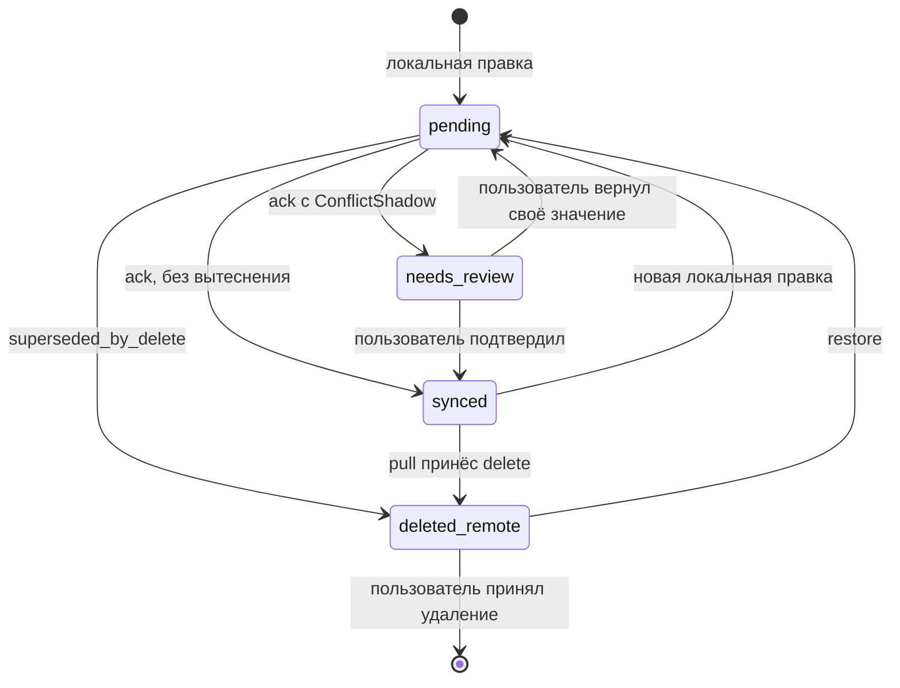

## Модель данных и инварианты

### 1. Область раздела

Раздел фиксирует канонические сущности синхронизации, их поля, инварианты и детерминированное правило разрешения конфликтов для сценария «один пользователь — несколько устройств — офлайн-правки». Модель рассчитана на то, что клиент может быть отключён от сети произвольно долго (до истечения горизонта надгробий, см. `INV-12`), а доставка операций — «как минимум один раз» с возможными дубликатами и повторами.

Базовое допущение всей модели: **авторитетом является сервер**. Клиент — это кэш последнего известного серверного состояния плюс журнал ещё не подтверждённых локальных операций. Любое локальное представление обязано быть выводимо из этой пары (`INV-7`).

---

### 2. Сущности

#### 2.1 `Record` — каноническая запись (сервер)

| Поле | Тип | Описание |
|---|---|---|
| `id` | UUIDv7 | Генерируется клиентом при создании. Глобально уникален, неизменяем, никогда не переиспользуется. |
| `owner_id` | UUID | Владелец. Неизменяем после создания. |
| `version` | uint64 | Версия записи. Инкрементируется **только сервером** на каждую принятую запись, строго монотонно. |
| `payload` | object | Доменные поля записи (плоский набор скалярных полей, см. границы §6). |
| `field_versions` | map<string, uint64> | Для каждого поля `payload` — версия, на которой поле изменилось в последний раз. Основа пофайлового слияния. |
| `deleted_at` | timestamp \| null | Серверное время удаления. `null` — запись жива. Удаление мягкое. |
| `deleted_by_device` | UUID \| null | Устройство, инициировавшее удаление. |
| `updated_at` | timestamp | Серверное время последней принятой записи. Диагностическое поле, в разрешении конфликтов не участвует. |
| `last_writer_device` | UUID | Устройство последней принятой записи. |
| `conflict_flag` | bool | Установлен, если последняя принятая версия получена через слияние с вытеснением значений. Сбрасывается клиентом через явное подтверждение пользователя. |

#### 2.2 `ChangeLogEntry` — журнал изменений (сервер)

| Поле | Тип | Описание |
|---|---|---|
| `change_seq` | uint64 | Глобально монотонный курсор в пределах `owner_id`. Единственный порядок, по которому клиент вычитывает изменения. |
| `record_id` | UUID | Изменённая запись. |
| `version` | uint64 | Версия записи после изменения. |
| `kind` | enum | `create` \| `update` \| `delete` \| `restore`. |
| `origin_device` | UUID | Автор изменения — позволяет клиенту не переигрывать собственные подтверждённые операции. |

#### 2.3 `Operation` — элемент локальной очереди (клиент; он же тело запроса на push)

| Поле | Тип | Описание |
|---|---|---|
| `op_id` | UUIDv4 | Ключ идемпотентности. Генерируется один раз при постановке в очередь и **не меняется при повторах**. |
| `device_id` | UUID | Устройство-автор. |
| `seq` | uint64 | Монотонный счётчик операций устройства. Определяет порядок отправки. |
| `record_id` | UUID | Целевая запись. |
| `kind` | enum | `create` \| `update` \| `delete` \| `restore`. |
| `base_version` | uint64 | Версия записи, которую видел пользователь в момент правки. Для `create` — `0`. |
| `patch` | map<string, value> | Только изменённые поля. Для `create` — полный набор, для `delete` — пусто. |
| `created_at` | timestamp | Локальные часы устройства. Только для UI и диагностики; в разрешении конфликтов **не используется** (`INV-9`). |
| `status` | enum | `queued` \| `inflight` \| `acked` \| `needs_review`. |
| `attempts` | uint | Счётчик повторов. |

#### 2.4 `LocalRecord` — материализованное представление (клиент)

| Поле | Тип | Описание |
|---|---|---|
| `id` | UUID | Совпадает с `Record.id`. |
| `server_version` | uint64 | Версия последнего вычитанного серверного состояния. |
| `server_payload` | object | Последнее известное серверное состояние (без наложенных локальных операций). |
| `effective_payload` | object | `server_payload` + все `queued`/`inflight` операции в порядке `seq`. То, что видит пользователь. |
| `sync_state` | enum | `synced` \| `pending` \| `needs_review` \| `deleted_remote`. |
| `deleted_locally` | bool | Пользователь удалил запись, `delete` ещё не подтверждён. |

#### 2.5 `ConflictShadow` — вытесненные значения

| Поле | Тип | Описание |
|---|---|---|
| `record_id` / `version` | UUID / uint64 | Версия, на которой произошло вытеснение. |
| `losing_device` | UUID | Устройство, чьё значение вытеснено. |
| `displaced_fields` | map<string, value> | Вытесненные значения полей. |
| `reason` | enum | `field_overwrite` \| `superseded_by_delete` \| `delete_over_unseen_edits`. |
| `expires_at` | timestamp | Срок хранения теней (§4.4). |

#### 2.6 `DeviceSyncState` — состояние синхронизации устройства

| Поле | Тип | Описание |
|---|---|---|
| `device_id` | UUID | Идентификатор установки приложения. Пересоздаётся при переустановке. |
| `last_pull_seq` | uint64 | Курсор в `ChangeLogEntry`. |
| `last_acked_seq` | uint64 | Последняя подтверждённая сервером операция устройства. |
| `schema_version` | uint | Версия схемы локальной БД. |

---

### 3. Инварианты

**Идентичность и версионирование**

- `INV-1` — `id` генерируется клиентом (UUIDv7), глобально уникален, неизменяем и никогда не переиспользуется, в том числе после удаления. Из этого следует идемпотентность `create` при повторной отправке.
- `INV-2` — `version` монотонно возрастает и инкрементируется исключительно сервером. Клиент никогда не присваивает `version`.
- `INV-3` — для каждого поля `f`: `field_versions[f] ≤ record.version`, и `record.version = max(field_versions.values())` при `deleted_at = null`.
- `INV-4` — `owner_id` неизменяем; операция, меняющая владельца, отвергается на уровне валидации, а не разрешается слиянием.

**Очередь операций**

- `INV-5` — `op_id` уникален глобально; сервер хранит отображение `op_id → resulting_version` и при повторе возвращает тот же результат без побочных эффектов. Повторная доставка не меняет состояние.
- `INV-6` — операции для одной записи применяются строго в порядке `seq` (FIFO **на запись**). Операции для разных записей независимы и могут отправляться параллельно — блокировка головы очереди локализована одной записью.
- `INV-7` — `effective_payload` детерминированно выводим из `server_payload` и очереди. Локальное состояние никогда не является единственным носителем факта: потеря `effective_payload` восстановима переигрыванием.
- `INV-8` — цепочка незавершённых операций для одной записи соответствует грамматике `create? update* (delete restore?)?`. Операция `update` после `delete` не ставится в очередь; вместо неё формируется `restore` с новым `base_version`.
- `INV-9` — часы устройства не участвуют в упорядочивании. Единственные источники порядка — `version` (внутри записи) и `change_seq` (внутри потока пользователя). Расхождение часов устройств не может привести к расхождению состояний.

**Удаление и надгробия**

- `INV-10` — удаление мягкое: `deleted_at` устанавливается, `payload` сохраняется до сборки мусора. Физическое удаление строки допускается только после истечения `T_tomb`.
- `INV-11` — `deleted_at` монотонно относительно версии: снять его может только явная операция `restore`, порождающая новую версию. Обычный `update` не воскрешает запись (§4.3).
- `INV-12` — надгробия и `ChangeLogEntry` хранятся не менее `T_tomb = 90 дней`. Если `last_pull_seq` устройства старше горизонта сборки мусора, инкрементальный pull запрещён — клиент обязан выполнить полную пересинхронизацию. Промежуточное состояние «частично устаревший курсор» недопустимо.

**Разрешение конфликтов**

- `INV-13` — правило разрешения конфликта — чистая функция от `(состояние записи на сервере, операция)`. Один и тот же вход даёт один и тот же выход при любом числе повторов и на любой реплике.
- `INV-14` — ни одно значение, введённое пользователем, не исчезает без следа: вытесненные значения записываются в `ConflictShadow` до `expires_at`. «Тихая» потеря правки — дефект, а не допустимый исход.
- `INV-15` — операция никогда не остаётся в `needs_review` бессрочно: этот статус обязан быть отражён в UI и разрешаться либо действием пользователя, либо истечением `expires_at` с последующим отбрасыванием.
- `INV-16` — сервер не хранит клиентоспецифичного состояния разрешения конфликтов: если клиент переустановлен, полная пересинхронизация даёт корректное состояние без обращения к теням.

---

### 4. Правило разрешения конфликтов

#### 4.1 Процедура (выполняется сервером атомарно на каждую операцию)

1. **Дедупликация.** Если `op_id` уже применён — вернуть сохранённый результат. Конец.
2. **Проверка удаления.** Если `record.deleted_at ≠ null` и `kind ∈ {update, create}` — перейти к §4.3 (доминирование удаления).
3. **Быстрый путь.** Если `op.base_version = record.version` — применить `patch`, `version += 1`, обновить `field_versions` для изменённых полей. Конфликта нет.
4. **Непересекающееся слияние.** Если `op.base_version < record.version`, но для каждого поля `f ∈ patch` выполняется `field_versions[f] ≤ op.base_version` — значит, эти поля никто не трогал с момента, который видел клиент. Применить как слияние, `version += 1`. Пользователю ничего не показывается: это штатный автомёрдж.
5. **Пересечение полей.** Для полей, где `field_versions[f] > op.base_version`, два устройства правили одно и то же поле. Разрешение — **последняя запись побеждает по порядку прибытия на сервер**: значение из входящей операции выигрывает, вытесненное значение записывается в `ConflictShadow(reason = field_overwrite)`, у записи выставляется `conflict_flag = true`. `version += 1`.

Порядок прибытия выбран единственным арбитром сознательно: он монотонен, наблюдаем сервером и не зависит от часов устройств (`INV-9`). Практическое следствие — выигрывает то устройство, которое **синхронизировалось позже**, а не то, на котором правка сделана позже. Для одного пользователя это совпадает в подавляющем большинстве случаев (устройство, с которого только что правили, синхронизируется первым при появлении сети), а расхождения покрываются `ConflictShadow` и флагом в UI.

#### 4.2 Матрица исходов

| `base_version` vs `version` | Пересечение полей | Удалена | Исход |
|---|---|---|---|
| равны | — | нет | Применить, `version += 1` |
| меньше | нет | нет | Автомёрдж, тихо |
| меньше | есть | нет | Входящая операция выигрывает, тень + `conflict_flag` |
| больше | — | — | Отклонить: клиент видел версию, которой сервер не выдавал (повреждение данных или откат БД) |
| любой | — | да, `kind = update` | §4.3, случай A |
| любой | — | нет, `kind = delete` | §4.3, случай B |

#### 4.3 Удаление против правки — обрабатывается отдельно

Удаление не сливается: оно терминально и идемпотентно. Поэтому здесь применяется не пофайловое слияние, а **доминирование удаления** — с обязательным уведомлением обеих сторон.

**Случай A. Устройство X удалило, устройство Y присылает `update` (`base_version ≤ версии удаления`).**

- Запись остаётся удалённой. `patch` не применяется, `version` не меняется.
- Сервер отвечает `superseded_by_delete` и возвращает `RecoverySnapshot` — предудалённый `payload` с наложенным `patch` клиента. Это то, чем запись стала бы, если бы удаления не было.
- Клиент Y переводит `LocalRecord.sync_state = deleted_remote`, сохраняет снимок локально и показывает: «запись удалена на другом устройстве, ваши изменения сохранены» с действием «восстановить».
- Восстановление — это явная операция `restore` с тем же `id` и `base_version` = версия удаления. Она снимает `deleted_at`, применяет снимок и даёт `version += 1`. Новый `id` не выдаётся: ссылки на запись остаются валидными, а `INV-1` гарантирует, что идентификатор свободен только для этой же записи.
- Если пользователь отказывается восстанавливать, операция отбрасывается, тень доживает до `expires_at`.

**Случай B. Устройство X правило (версия N), устройство Y присылает `delete` с `base_version < N`.**

- `delete` применяется независимо от `base_version`: пользователь выразил намерение удалить запись, и отказ в удалении оставил бы данные, которые он считает уничтоженными.
- Однако сервер фиксирует, что удалены непросмотренные правки: `ConflictShadow(reason = delete_over_unseen_edits)` с полным `payload` версии N.
- Устройство Y получает в ответе признак `deleted_unseen_edits = true` и показывает: «удалённая запись содержала изменения, которых вы не видели» с действием «восстановить». Устройство X при следующем pull получает `delete` штатным путём.

**Ключевой момент:** удаление всегда побеждает правку по состоянию данных, но никогда не побеждает её молча. Разница между случаями A и B — только в том, какое устройство получает предложение восстановить.

#### 4.4 Жизненный цикл локальной записи

Срок хранения теней: `T_shadow = 30 дней` для `field_overwrite` и `T_tomb = 90 дней` для теней, связанных с удалением, — чтобы устройство, отсутствовавшее в сети весь допустимый офлайн-период, всё ещё получило уведомление, а не тихую потерю.

---

### 5. Следствия для реализации

- Клиент обязан хранить `server_payload` отдельно от `effective_payload`. Без этого `INV-7` не выполняется, а переигрывание очереди после сбоя даёт накопленное искажение.
- `patch` содержит только изменённые поля. Отправка полного объекта превращает любую параллельную правку в конфликт по всем полям и обесценивает автомёрдж §4.1.4.
- `field_versions` растёт линейно по числу полей — при расширении `payload` за пределы плоского набора скаляров стоимость слияния нужно пересматривать (см. границы).
- Очередь и материализованное представление должны обновляться в одной транзакции локальной БД: операция, попавшая в очередь без отражения в `effective_payload` (или наоборот), нарушает `INV-7`.

---

### 6. Границы: что этот раздел не описывает

**Транспорт и протокол**
- Формат эндпоинтов push/pull, батчинг, сжатие, пагинация журнала изменений.
- Политика повторов, экспоненциальный откат, детекция сетевого состояния, ограничения фоновых задач iOS/Android.
- Аутентификация, авторизация и ротация токенов; `owner_id` здесь считается уже установленным и доверенным.

**Многопользовательские сценарии**
- Совместное редактирование разными пользователями, шаринг, ACL, ролевые модели. Модель рассчитана на одного владельца; конфликт «пользователь против пользователя» имеет иную семантику и в этих правилах не разрешается.
- Совместное редактирование текста в реальном времени (CRDT/OT). Выбор в пользу пофайлового LWW сделан осознанно: `payload` состоит из скалярных полей, и стоимость CRDT здесь не окупается. При появлении длинных текстовых полей решение подлежит пересмотру в отдельном разделе.

**Данные за пределами `payload`**
- Вложения и бинарные объекты: синхронизируются отдельным content-addressed конвейером, здесь живёт только ссылка на объект. Согласованность «запись ↔ вложение» описывается в разделе о медиа.
- Производные серверные данные: поисковые индексы, агрегаты, ленты, рассылка push-уведомлений о чужих изменениях.

**Хранение и эволюция**
- Физическая схема БД (DDL, индексы, шардирование), план сборки мусора надгробий.
- Миграции локальной БД между версиями приложения и правила эволюции схемы `payload` (добавление, удаление и смена типа поля во время активной очереди операций) — это отдельный раздел; отмечается как известный риск для `INV-3`.
- Шифрование данных в покое и при передаче, управление ключами.

**Эксплуатация и UX**
- Метрики, целевые показатели частоты конфликтов, алертинг, инструменты ручного разбора инцидентов рассинхрона.
- Конкретные формулировки, размещение и поведение интерфейса разрешения конфликтов. Раздел задаёт только контракт: какие состояния и данные UI обязан получить (`needs_review`, `deleted_remote`, `ConflictShadow`) и что ни одно из них не может быть проигнорировано (`INV-15`).