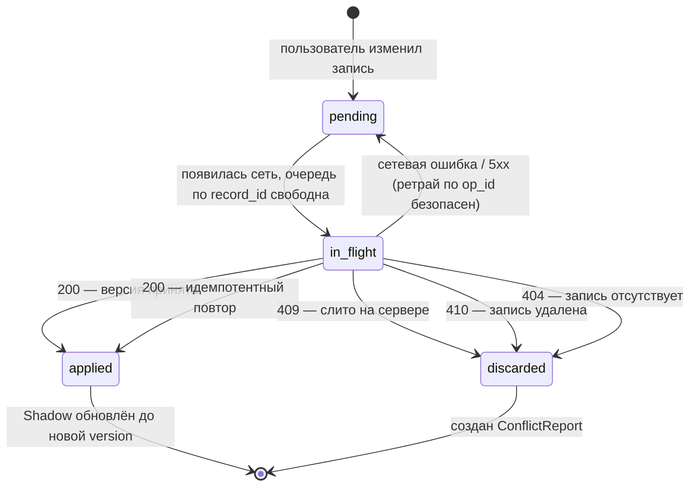

## 4. Модель данных и инварианты

### 4.1. Допущения раздела

1. У записи ровно один владелец. Все конкурирующие изменения порождены **одним человеком с разных устройств** — значит, цена автоматического слияния ниже, чем цена диалога «разрешите конфликт» на каждый чих.
2. Сервер — единственный источник истины о порядке. Часы устройств недоверенные: устройство может быть офлайн неделю, иметь сбитую таймзону или переведённое вручную время. **Ни одно решение о конфликте не опирается на wall clock устройства.**
3. Клиент не имеет права терять пользовательский ввод молча. Любая непринятая операция обязана оставить след, доступный пользователю.

---

### 4.2. Сущности

#### 4.2.1. `Record` — каноническая запись (сервер)

| Поле | Тип | Описание |
|---|---|---|
| `record_id` | UUID v7 | Первичный ключ. Генерируется устройством-создателем, не сервером. Неизменен. |
| `owner_id` | UUID | Владелец. Неизменен после создания. |
| `version` | int64, ≥ 1 | Счётчик ревизий. +1 на каждую принятую операцию. Основа оптимистической блокировки. |
| `attributes` | JSON object | Прикладное тело записи. Схема — вне этого раздела (см. §4.7). |
| `state` | enum `active` \| `deleted` | Жизненный цикл. `deleted` — терминальное состояние. |
| `deleted_at` | timestamp, nullable | Серверное время удаления. |
| `last_op_id` | UUID | Операция, породившая текущую версию. Ключ идемпотентности. |
| `last_device_id` | UUID | Устройство-автор текущей версии. Только для наблюдаемости, в логике не участвует. |
| `server_updated_at` | timestamp | Серверное время. Только для наблюдаемости, **не для упорядочивания**. |

#### 4.2.2. `ChangeLogEntry` — журнал изменений (сервер)

Append-only лента, по которой клиент забирает дельту. Заменяет собой пагинацию по времени: курсор по времени ломается при перекосе часов и при откате транзакций.

| Поле | Тип | Описание |
|---|---|---|
| `seq` | int64, глобально монотонный | Позиция в журнале. Курсор клиента — это `seq`, не timestamp. |
| `record_id` | UUID | Изменённая запись. |
| `version` | int64 | Версия записи после изменения. |
| `owner_id` | UUID | Для шардирования выборки по владельцу. |
| `kind` | enum `upsert` \| `delete` | Тип события. |
| `snapshot` | JSON object, nullable | Полное тело записи после изменения. `null` для `delete`. |

#### 4.2.3. `Shadow` — база синхронизации (клиент)

Немодифицированный снимок серверного состояния, каким его последний раз видело устройство. Пользовательские правки в `Shadow` **не пишутся никогда**.

| Поле | Тип | Описание |
|---|---|---|
| `record_id` | UUID | |
| `base_version` | int64 | Версия сервера, соответствующая `base_attributes`. |
| `base_attributes` | JSON object | Снимок как есть с сервера. |
| `base_state` | enum `active` \| `deleted` | |
| `synced_seq` | int64 | Позиция журнала, из которой получен снимок. |

#### 4.2.4. `Operation` — элемент очереди (клиент)

| Поле | Тип | Описание |
|---|---|---|
| `op_id` | UUID v7 | Генерируется на устройстве. Ключ идемпотентности для сервера. |
| `local_seq` | int64, монотонный на устройстве | Порядок в очереди. Единственный авторитет упорядочивания на клиенте. |
| `record_id` | UUID | |
| `type` | enum `create` \| `update` \| `delete` | |
| `base_version` | int64 | Значение `Shadow.base_version` на момент постановки в очередь. |
| `changed_fields` | JSON object, nullable | **Только изменённые поля**, не всё тело. Ключевое решение: оно делает слияние по полям возможным. `null` для `delete`. |
| `status` | enum `pending` \| `in_flight` \| `applied` \| `discarded` | |
| `attempts` | int | Счётчик попыток доставки. |
| `authored_at` | timestamp | Время по часам устройства. **Только для отображения в UI**, в разрешении конфликтов не участвует. |

#### 4.2.5. `ConflictReport` — след разрешённого конфликта (клиент)

Append-only. Существует, чтобы ни одно перезаписанное или отброшенное изменение не исчезло бесследно.

| Поле | Тип | Описание |
|---|---|---|
| `conflict_id` | UUID | |
| `record_id`, `op_id` | UUID | Что и чем конфликтовало. |
| `kind` | enum `field_overwrite` \| `delete_vs_update` \| `missing_record` | Классификация исхода. |
| `server_version` | int64 | Версия на сервере в момент конфликта. |
| `lost_values` | JSON object | Локальные значения, не попавшие в канон. Материал для восстановления. |
| `resolution` | enum `auto_merged` \| `tombstone_won` \| `dropped` | Как разрешилось. |
| `acknowledged` | bool | Показан ли пользователю. |

#### 4.2.6. `SyncCursor` — состояние синхронизации (клиент)

| Поле | Тип | Описание |
|---|---|---|
| `device_id` | UUID | |
| `last_seq` | int64 | Последняя обработанная позиция журнала. |
| `last_full_resync_at` | timestamp | Для контроля окна ретенции (см. И-13). |

---

### 4.3. Инварианты

**Серверные**

- **И-1.** `record_id` уникален глобально и неизменен. Создание записи идемпотентно по `record_id`: повторный `create` с тем же идентификатором не порождает дубликат.
- **И-2.** `version` строго монотонно возрастает на единицу при каждой принятой операции. Значения не переиспользуются и не убывают.
- **И-3.** Каждому приросту `version` соответствует ровно одна запись в `ChangeLogEntry`. Обратное тоже верно: журнал и версии не расходятся.
- **И-4.** `state` переходит только `active → deleted`. Обратного перехода нет. Восстановление удалённой записи — это **создание новой записи с новым `record_id`**, а не воскрешение старой.
- **И-5.** `deleted_at IS NOT NULL` ⟺ `state = deleted`.
- **И-6.** `op_id` применённых операций хранится не менее окна ретенции `T`. Повторная доставка того же `op_id` возвращает результат первого применения и **не увеличивает `version`**. Ретрай при неизвестном исходе сети безопасен.
- **И-7.** `record_id`, `owner_id` и время создания никогда не входят в `changed_fields`. Попытка их изменить — ошибка валидации, а не конфликт.

**Клиентские**

- **И-8.** Локальное отображение записи есть детерминированная свёртка: `view = fold(base_attributes, ops[record_id] в порядке local_seq)`. Материализованный кэш обязан пересчитываться при любой мутации очереди — расхождение кэша и свёртки есть дефект.
- **И-9.** Очередь FIFO **в пределах одного `record_id`**. Операции по одной записи уходят строго по возрастанию `local_seq`; одновременно в статусе `in_flight` может быть не более одной операции на запись. Между разными записями порядок не гарантируется и не нужен.
- **И-10.** У каждой операции `base_version` равен `Shadow.base_version` на момент постановки в очередь и никогда не превышает его.
- **И-11.** После постановки в очередь операции `delete` для записи новые `update` по этой записи в очередь не принимаются.
- **И-12.** Операция покидает очередь только с терминальным исходом: `applied` либо `discarded` с созданным `ConflictReport`. Молчаливое исчезновение операции запрещено.
- **И-13.** Если `SyncCursor.last_seq` вышел за окно ретенции журнала `T`, инкрементальный pull запрещён — устройство обязано выполнить полную пересинхронизацию. Иначе оно не увидит удалений, чьи tombstone уже вычищены.

**Сквозной**

- **И-14.** Ни одно решение о порядке или о победителе конфликта не использует часы устройства. Порядок определяется парой (`version`, порядок прибытия на сервер).

---

### 4.4. Правило разрешения конфликтов

#### 4.4.1. Обнаружение

Сервер сравнивает `op.base_version` с текущей `record.version`:

- **равны** — быстрый путь, операция применяется, `version += 1`;
- **не равны** — запись изменилась после того, как устройство её видело. Конфликт.

#### 4.4.2. Слияние по полям (`update` против `update`)

Операция несёт **только изменённые поля**, поэтому устаревшая база не означает устаревших данных. Сервер накладывает `changed_fields` поверх *текущей* версии, а не поверх `base_version`.

- **Непересекающиеся поля.** Устройство A правит `title`, устройство B — `due_date`. Обе операции применяются, обе версии засчитываются, результат один и тот же при любом порядке доставки. Пользователя не спрашивают.
- **Пересекающиеся поля.** Побеждает операция, **прибывшая на сервер позже** — то есть получившая больший `version`. Проигравшее значение записывается в `ConflictReport(kind = field_overwrite)`, и пользователь может его увидеть и вернуть.

Обоснование выбора: правки принадлежат одному человеку, и «последний по прибытию» совпадает с «последний по намерению» во всех случаях, кроме гонки двух устройств в одну минуту — редкой и покрытой отчётом о конфликте.

#### 4.4.3. Удаление против правки

Tombstone **поглощающий**: удаление выигрывает всегда, независимо от порядка прибытия и от `base_version`.

- **Удаление пришло первым, следом правка.** Правка отбрасывается. Сервер возвращает `410 Gone`; клиент создаёт `ConflictReport(kind = delete_vs_update)` с полным телом локальной версии, помечает `Shadow` удалённым и показывает пользователю: «Запись удалена на другом устройстве. Ваши изменения сохранены — восстановить как новую?».
- **Правка пришла первой, следом удаление.** `delete` применяется без проверки `base_version` — удаление намеренно не является операцией оптимистической блокировки.

Оба порядка приводят в одно и то же состояние `deleted`, поэтому сходимость не зависит от порядка доставки — это и есть причина сделать удаление поглощающим, а не «последним по времени».

Восстановление по кнопке в диалоге создаёт **новую запись с новым `record_id`** (И-4). Старый `record_id` остаётся мёртвым навсегда, иначе устройство, уже вычистившее tombstone, увидело бы воскрешение как рассинхрон.

#### 4.4.4. Операция по несуществующей записи

`update` по `record_id`, которого сервер не знает (никогда не существовал либо tombstone вычищен по ретенции): операция отбрасывается, создаётся `ConflictReport(kind = missing_record)`, `Shadow` удаляется локально. Автосоздание записи из `update` запрещено — оно маскирует ошибки клиента и воскрешает удалённое.

#### 4.4.5. Сводная таблица исходов

| Локальная операция | Состояние на сервере | Исход | Отчёт о конфликте |
|---|---|---|---|
| `update`, `base_version` совпал | `active` | Применена | — |
| `update`, база устарела, поля не пересекаются | `active` | Слита автоматически | — |
| `update`, база устарела, поля пересекаются | `active` | Применена, чужое значение перезаписано | `field_overwrite` |
| `update` | `deleted` | Отброшена | `delete_vs_update` |
| `delete`, любая база | `active` | Применена | — |
| `delete` | `deleted` | Идемпотентный no-op | — |
| `create`, тот же `op_id` | существует | Идемпотентный no-op | — |
| `update` | запись отсутствует | Отброшена | `missing_record` |

#### 4.4.6. Гарантии

- **Сходимость.** После обмена всеми накопленными операциями все устройства владельца приходят к одинаковому состоянию.
- **Детерминированность по порядку доставки.** Гарантируется для удалений и для правок непересекающихся полей. Для конкурентной правки **одного и того же поля** итоговое значение зависит от порядка прибытия — это единственная точка недетерминизма в модели, и она сознательно оставлена в обмен на отсутствие диалогов разрешения конфликтов в типовом сценарии.
- **Сохранность ввода.** Любое значение, не попавшее в канон, остаётся в `ConflictReport.lost_values` до подтверждения пользователем.

---

### 4.5. Жизненный цикл операции

Переход в `discarded` без созданного `ConflictReport` невозможен (И-12).

---

### 4.6. Границы: что этот раздел **не** описывает

- **Схему `attributes`** — состав прикладных полей, их типы и валидацию. Раздел трактует тело записи как непрозрачный объект. См. «Доменная модель».
- **Транспорт и протокол синхронизации** — эндпойнты, формат батчей, размер страницы журнала, политику ретраев и backoff, аутентификацию и авторизацию запросов. См. «Протокол синхронизации».
- **Многопользовательское редактирование.** Модель рассчитана на одного владельца и его устройства. Совместный доступ, шаринг и права требуют другой дисциплины разрешения конфликтов (как минимум — фиксации намерения, а не последнего прибытия) и в этой модели не поддержаны.
- **Вложения и бинарные данные.** Файлы не проходят через `changed_fields` и требуют отдельной стратегии (контентная адресация, докачка, отдельный жизненный цикл tombstone).
- **Миграции схемы** — эволюцию `attributes`, версионирование API и поведение при работе клиента старой версии с новым сервером.
- **Политику ретенции и вычистки** — конкретное значение `T`, расписание сборки tombstone, архивацию журнала. Раздел фиксирует только инвариант И-13, связывающий ретенцию с обязательной пересинхронизацией.
- **Квоты и backpressure** — предельный размер очереди операций и поведение при его исчерпании.
- **UI разрешения конфликтов** — экраны, тексты и момент показа. Раздел определяет только контракт данных `ConflictReport`, достаточный для любого UI.
- **Шифрование** — на устройстве и в канале, управление ключами.
- **Физическую реализацию** — движок локальной БД, индексы, партиционирование журнала, схему хранения на сервере.