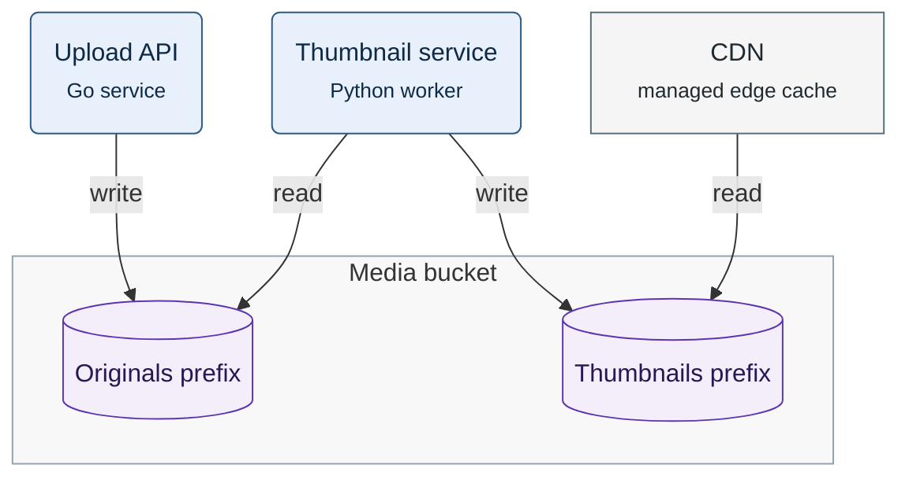

**Figure 1.** Media bucket relations: which prefix of the Media bucket each component writes or reads.

Legend:
- rounded box = Gallery team service; rectangle = managed service
- grey frame = Media bucket; cylinder = one of its two prefixes
- arrow = a write or a read, from the component to the prefix