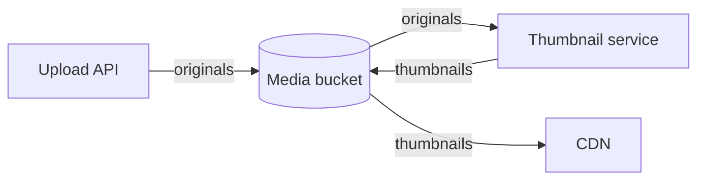

```mermaid
flowchart LR
    accTitle: Media storage relations
    accDescr: The Upload API writes originals to the Media bucket. The Thumbnail service reads originals from the Media bucket and writes thumbnails to it. The CDN reads thumbnails from the Media bucket.

    upload["Upload API"]
    bucket[("Media bucket")]
    thumbs["Thumbnail service"]
    cdn["CDN"]

    upload -->|originals| bucket
    bucket -->|originals| thumbs
    thumbs -->|thumbnails| bucket
    bucket -->|thumbnails| cdn
```

*Figure 2.1: Relations between the media storage components. Arrows point in the direction the images move. An arrow into the Media bucket is a write, and an arrow out of it is a read.*