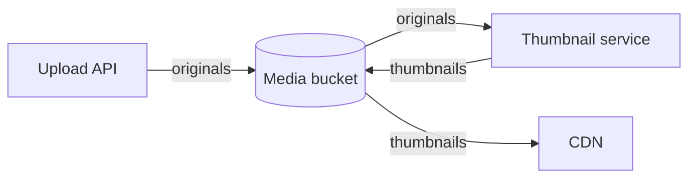

*Figure 2.1: Media storage relations. Arrows show the direction in which originals and thumbnails move. The Upload API and the Thumbnail service write to the Media bucket, and the Thumbnail service and the CDN read from it.*