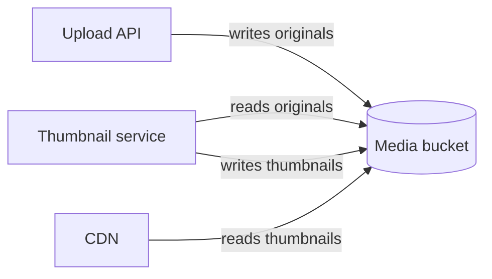

```mermaid
flowchart LR
    accTitle: Media storage relations
    accDescr: The Upload API writes originals to the Media bucket. The Thumbnail service reads originals from the Media bucket and writes thumbnails to it. The CDN reads thumbnails from the Media bucket.

    upload["Upload API"]
    thumbs["Thumbnail service"]
    cdn["CDN"]
    bucket[("Media bucket")]

    upload -->|"writes originals"| bucket
    thumbs -->|"reads originals"| bucket
    thumbs -->|"writes thumbnails"| bucket
    cdn -->|"reads thumbnails"| bucket
```