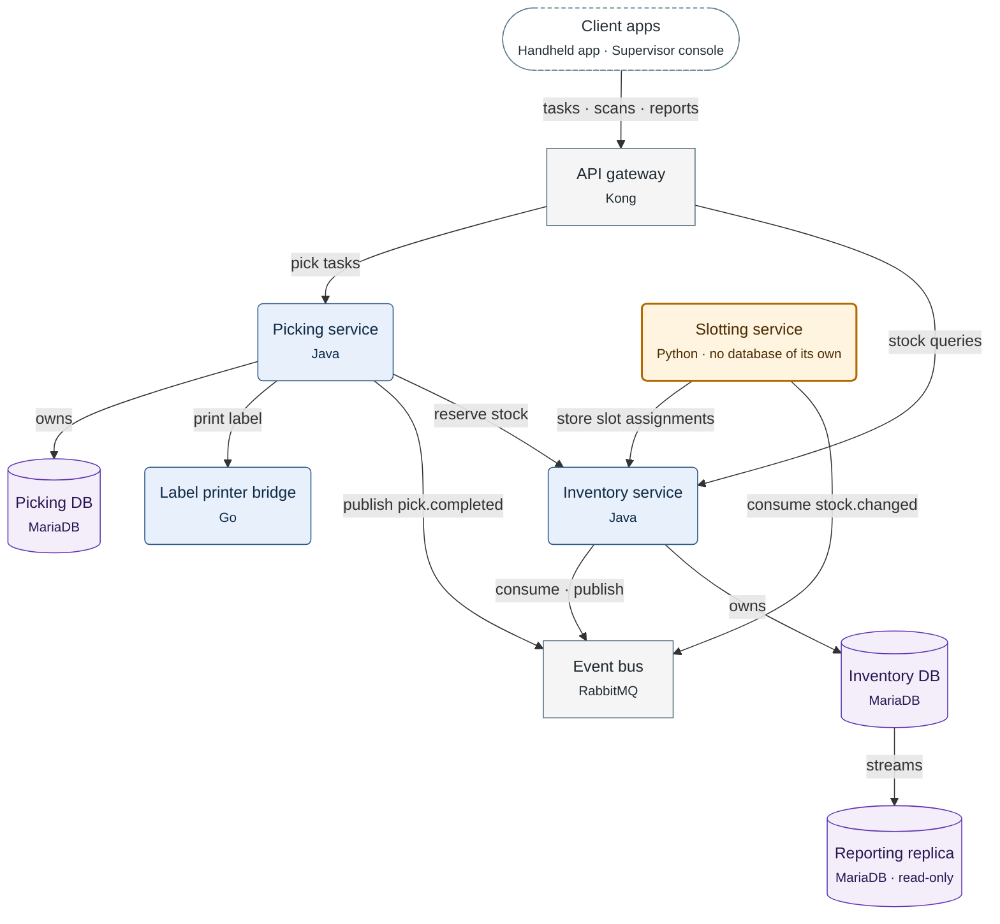

**Figure 3.1.** Larkspur WMS containers: who calls whom, which service owns which database, and the replication of the Inventory DB.

Legend:
- dashed stadium = the two client apps
- rounded box = a service the Larkspur team writes; orange with a thick border = added by this task
- rectangle = an off-the-shelf product; cylinder = a database
- arrow = a call, from caller to callee; an arrow labelled `owns` points from a service to its database; `streams` = the replication stream
- client calls use HTTPS, calls to the Event bus use AMQP, and every other call uses gRPC
- not drawn: the zones, which the table above gives