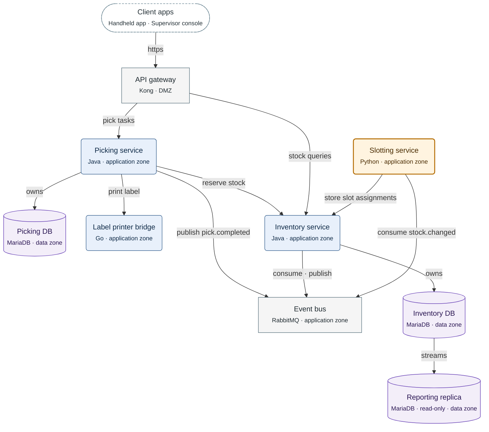

**Figure 3.1.** Larkspur WMS containers: the calls between them, the databases the services own and the replication stream.

Legend:
- dashed stadium = the two client apps
- rounded box = service the Larkspur team writes; orange with a thick border = added by this task
- rectangle = off-the-shelf product; cylinder = database
- second line = technology and zone
- arrow labelled `owns` = the service owns the database; arrow labelled `streams` = replication;
  every other arrow = a call, from caller to callee