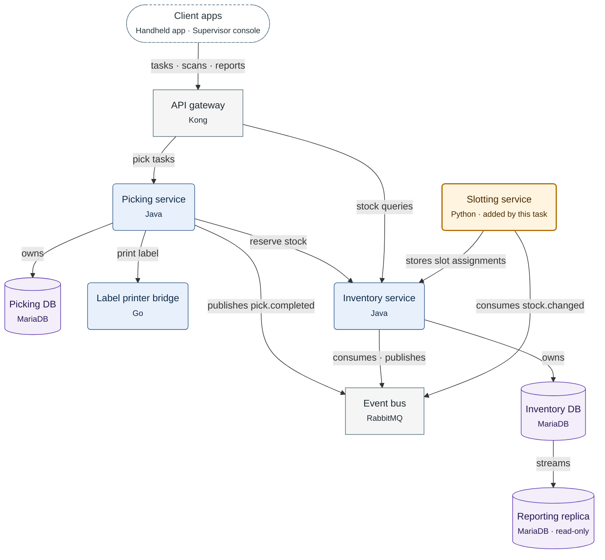

**Figure 3.1.** Larkspur WMS containers: who calls whom, which service owns which database, and the stream to the Reporting replica.

Legend:
- dashed stadium = client apps; rounded box = service the Larkspur team writes; orange with a thick border = added by this task
- rectangle = off-the-shelf product; cylinder = database
- arrow = call, from caller to callee; `owns` = the service owns the database; `streams` = the database streams to the replica

Client calls use HTTPS, calls to the Event bus use AMQP, and every other call uses gRPC. The Inventory service consumes `pick.completed` and publishes `stock.changed`. Not drawn: the zone of each container, which the Zone column of the table lists.