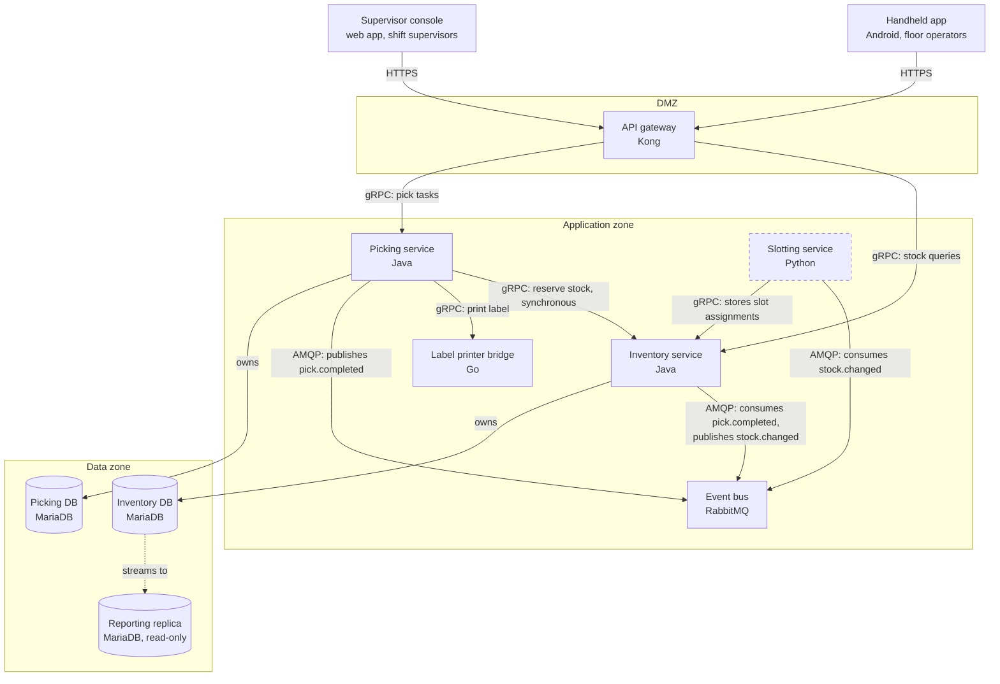

The figure groups the containers by zone. Arrows run from caller to callee, as listed in §3.2. The dashed box is the Slotting service that this task adds, and the dotted arrow is database replication.

