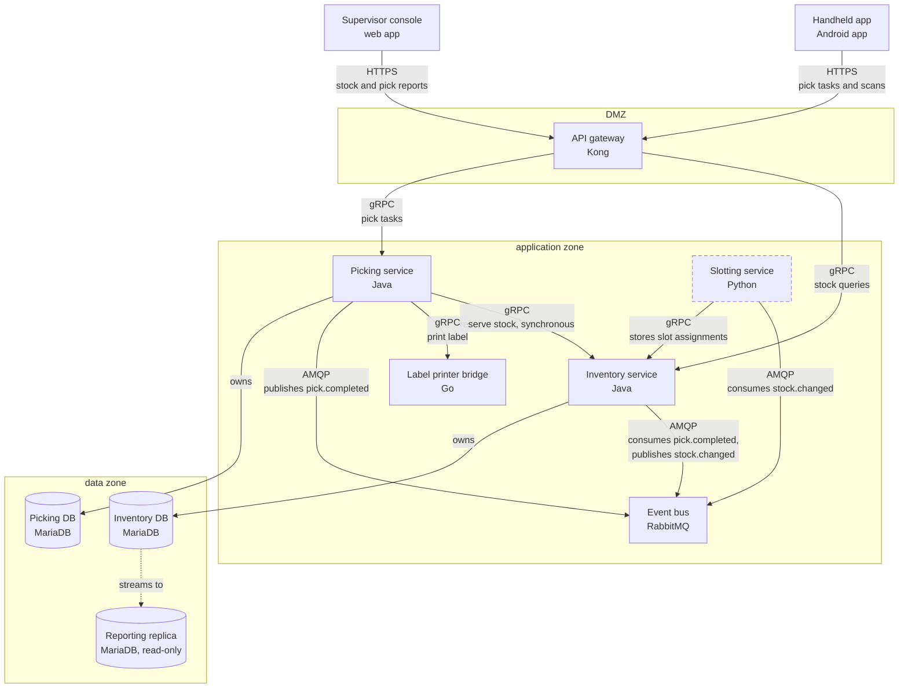

```mermaid
flowchart TB
    accTitle: Larkspur WMS containers
    accDescr: The Handheld app and Supervisor console call the API gateway in the DMZ. The gateway calls the Inventory and Picking services in the application zone. The services exchange events through the Event bus. The Inventory and Picking services each own a database in the data zone, and the Inventory DB streams to the Reporting replica.

    handheld["Handheld app<br/>Android app"]
    console["Supervisor console<br/>web app"]

    subgraph dmz["DMZ"]
        gw["API gateway<br/>Kong"]
    end

    subgraph appzone["application zone"]
        inv["Inventory service<br/>Java"]
        pick["Picking service<br/>Java"]
        slot["Slotting service<br/>Python"]
        printer["Label printer bridge<br/>Go"]
        bus["Event bus<br/>RabbitMQ"]
    end

    subgraph datazone["data zone"]
        invdb[("Inventory DB<br/>MariaDB")]
        pickdb[("Picking DB<br/>MariaDB")]
        replica[("Reporting replica<br/>MariaDB, read-only")]
    end

    handheld -->|"HTTPS<br/>pick tasks and scans"| gw
    console -->|"HTTPS<br/>stock and pick reports"| gw
    gw -->|"gRPC<br/>stock queries"| inv
    gw -->|"gRPC<br/>pick tasks"| pick
    pick -->|"gRPC<br/>reserve stock, synchronous"| inv
    pick -->|"gRPC<br/>print label"| printer
    pick -->|"AMQP<br/>publishes pick.completed"| bus
    inv -->|"AMQP<br/>consumes pick.completed,<br/>publishes stock.changed"| bus
    slot -->|"AMQP<br/>consumes stock.changed"| bus
    slot -->|"gRPC<br/>stores slot assignments"| inv
    inv -->|owns| invdb
    pick -->|owns| pickdb
    invdb -.->|streams to| replica

    classDef added stroke-dasharray: 6 4
    class slot added
```

*Figure 3.1 — Larkspur WMS containers by zone. Solid arrows run from caller to callee, and the dotted arrow is database replication. The dashed border marks Slotting service, which this task adds.*