```mermaid
flowchart TB
    handheld("Handheld app<br/>Android, floor operators")
    supervisor("Supervisor console<br/>web app, shift supervisors")

    subgraph dmz["DMZ"]
        gateway["API gateway<br/>Kong"]
    end

    subgraph appZone["Application zone"]
        inventory["Inventory service<br/>Java"]
        picking["Picking service<br/>Java"]
        slotting["Slotting service<br/>Python · new"]
        printer["Label printer bridge<br/>Go"]
        bus["Event bus<br/>RabbitMQ"]
    end

    subgraph dataZone["Data zone"]
        inventoryDb[("Inventory DB<br/>MariaDB")]
        pickingDb[("Picking DB<br/>MariaDB")]
        replica[("Reporting replica<br/>MariaDB, read-only")]
    end

    handheld -->|"HTTPS<br/>pick tasks and scans"| gateway
    supervisor -->|"HTTPS<br/>stock and pick reports"| gateway
    gateway -->|"gRPC<br/>stock queries"| inventory
    gateway -->|"gRPC<br/>pick tasks"| picking
    picking -->|"gRPC<br/>reserve stock, synchronous"| inventory
    picking -->|"gRPC<br/>print label"| printer
    picking -->|"AMQP<br/>publishes pick.completed"| bus
    inventory -->|"AMQP<br/>consumes pick.completed,<br/>publishes stock.changed"| bus
    slotting -->|"AMQP<br/>consumes stock.changed"| bus
    slotting -->|"gRPC<br/>stores slot assignments"| inventory

    inventory ---|"owns"| inventoryDb
    picking ---|"owns"| pickingDb
    inventoryDb -.->|"streams to"| replica

    classDef added stroke-dasharray: 5 5, stroke-width: 2px
    class slotting added
```

*Figure 3.1 — Larkspur WMS containers. Solid arrows are calls from caller to callee, labelled with protocol and purpose. Plain lines join a service to the database it owns, and the dotted arrow is replication. The dashed box is the Slotting service, which this task adds.*