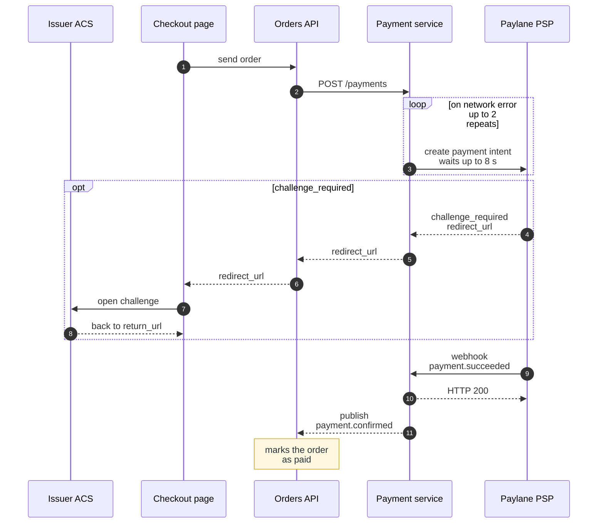

**Figure 4.1.** Card payment with a 3-D Secure challenge: steps 1 to 11 of §4.2.1 as numbered messages, with the repeat of step 3 as a loop and the challenge as an option.

- Solid arrow = call, where the sender waits for the result. Dashed arrow = reply or unwaited message. Numbers = the steps of §4.2.1.
- `loop` = step 3 repeats on a network error, up to 2 times, with the same idempotency key.
- `opt` = steps 4 to 8 run only when Paylane PSP answers `challenge_required`. On `authorized`, the payment continues at step 9.
- Note = what the Orders API does when it consumes `payment.confirmed`.

The figure leaves out the request fields of Table 4.3 and the time limits of §4.2.3.