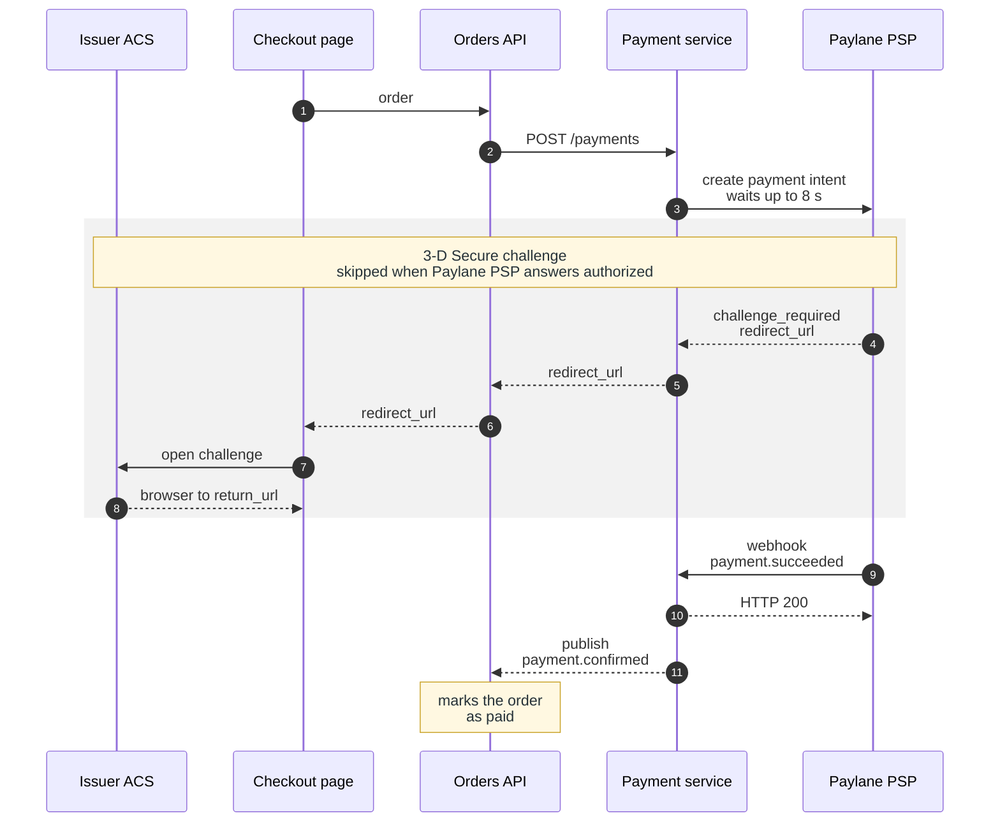

**Figure 4.2.** Card payment with a 3-D Secure challenge — the eleven steps of §4.2.1 between the five parties, numbered as in the list, with the challenge steps 4 to 8 shaded.

Legend:
- solid arrow = call; dashed arrow = reply or unwaited message; numbers = the steps of §4.2.1;
- grey band = the 3-D Secure challenge, named by its first note; the other note states the outcome of step 11.

Not drawn: the repeats of step 3 after a network error, the nine fields of step 2 (Table 4.3), the time limits of §4.2.3 and the boundary of the Brightwater store.