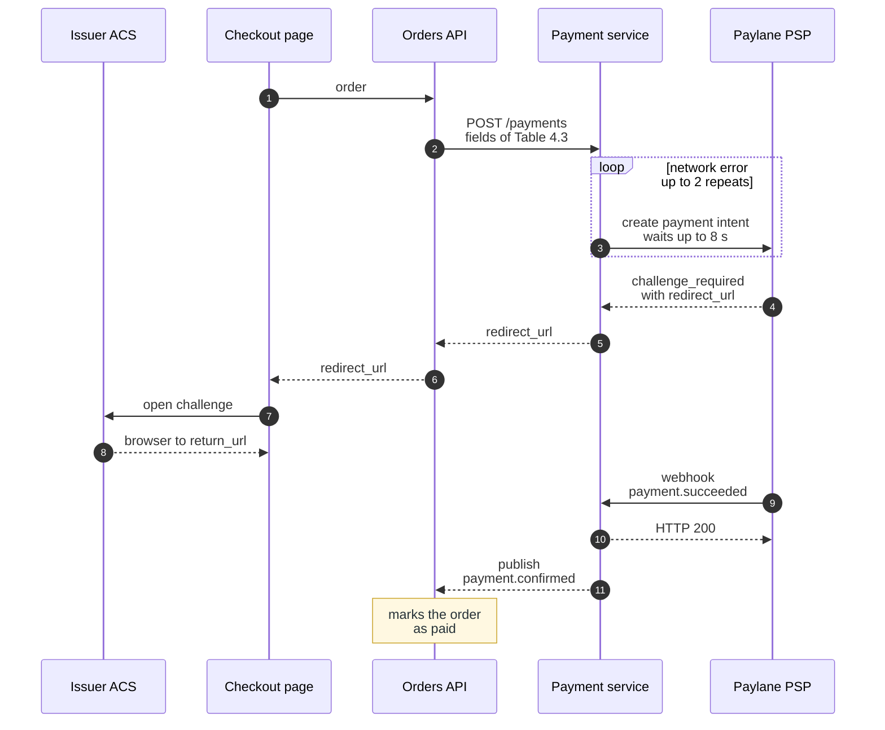

**Figure 4.1.** Card payment with a 3-D Secure challenge — steps 1 to 11 of §4.2.1 when Paylane PSP answers `challenge_required`, with the repeats of step 3 on a network error.

- solid arrow = call, the sender waits for the result; dashed arrow = reply, or a message the sender does not wait on;
- number = the step of §4.2.1; note = the rest of step 11;
- `loop` = step 3 repeats on a network error, up to 2 times, with the same idempotency key;
- Issuer ACS and Paylane PSP, at the two ends, are external; the three participants between them belong to the Brightwater store.

Not drawn: when Paylane PSP answers `authorized`, the payment skips steps 4 to 8 and continues at step 9. The fields of `POST /payments` stay in Table 4.3, and the time limits stay in §4.2.3.