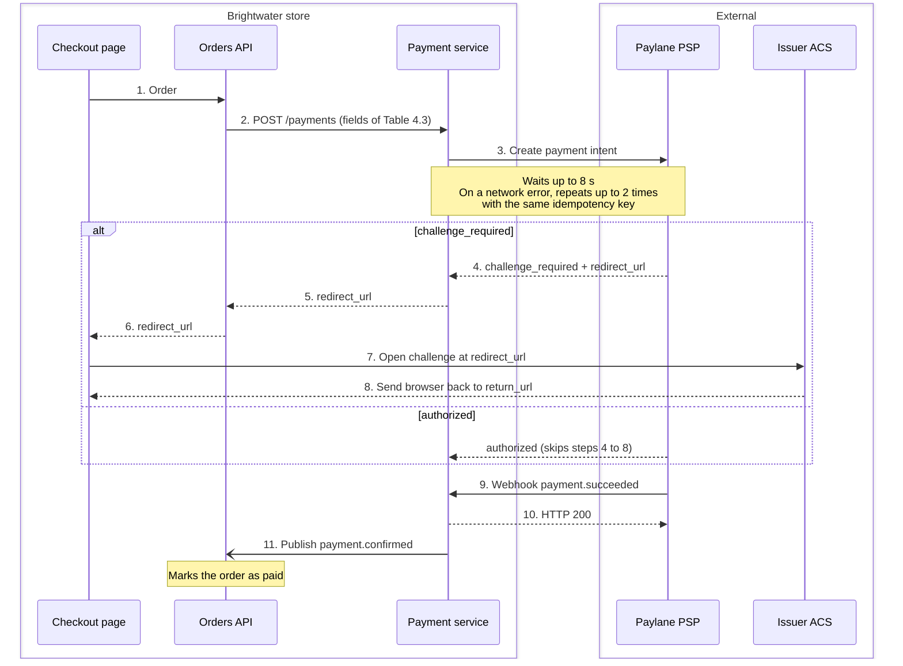

```mermaid
sequenceDiagram
    box Brightwater store
        participant CP as Checkout page
        participant OA as Orders API
        participant PS as Payment service
    end
    box External
        participant PSP as Paylane PSP
        participant ACS as Issuer ACS
    end

    CP->>OA: 1. Order
    OA->>PS: 2. POST /payments (fields of Table 4.3)
    PS->>PSP: 3. Create payment intent
    Note over PS,PSP: Waits up to 8 s<br/>On a network error, repeats up to 2 times<br/>with the same idempotency key
    alt challenge_required
        PSP-->>PS: 4. challenge_required + redirect_url
        PS-->>OA: 5. redirect_url
        OA-->>CP: 6. redirect_url
        CP->>ACS: 7. Open challenge at redirect_url
        ACS-->>CP: 8. Send browser back to return_url
    else authorized
        PSP-->>PS: authorized (skips steps 4 to 8)
    end
    PSP->>PS: 9. Webhook payment.succeeded
    PS-->>PSP: 10. HTTP 200
    PS-)OA: 11. Publish payment.confirmed
    Note over OA: Marks the order as paid
```