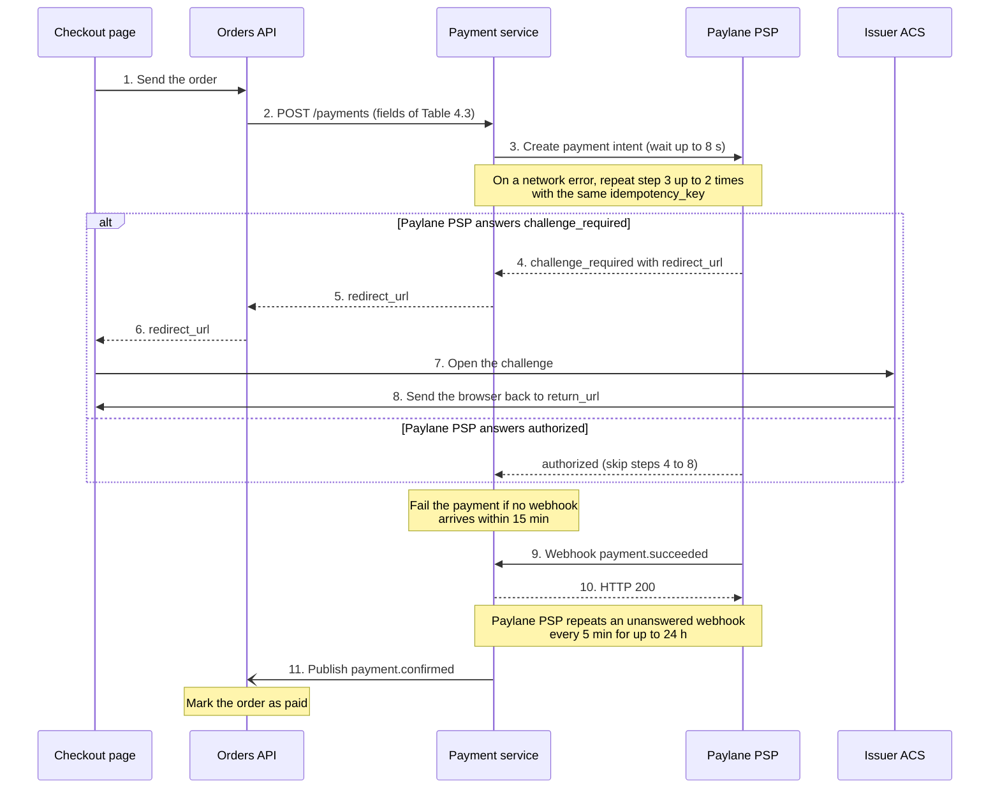

The diagram shows the steps of 4.2.1. The number on each arrow is the step number.

```mermaid
sequenceDiagram
    participant CP as Checkout page
    participant OA as Orders API
    participant PS as Payment service
    participant PSP as Paylane PSP
    participant ACS as Issuer ACS

    CP->>OA: 1. Send the order
    OA->>PS: 2. POST /payments (fields of Table 4.3)
    PS->>PSP: 3. Create payment intent (wait up to 8 s)
    Note over PS,PSP: On a network error, repeat step 3 up to 2 times<br/>with the same idempotency_key
    alt Paylane PSP answers challenge_required
        PSP-->>PS: 4. challenge_required with redirect_url
        PS-->>OA: 5. redirect_url
        OA-->>CP: 6. redirect_url
        CP->>ACS: 7. Open the challenge
        ACS->>CP: 8. Send the browser back to return_url
    else Paylane PSP answers authorized
        PSP-->>PS: authorized (skip steps 4 to 8)
    end
    Note over PS: Fail the payment if no webhook<br/>arrives within 15 min
    PSP->>PS: 9. Webhook payment.succeeded
    PS-->>PSP: 10. HTTP 200
    Note over PS,PSP: Paylane PSP repeats an unanswered webhook<br/>every 5 min for up to 24 h
    PS-)OA: 11. Publish payment.confirmed
    Note over OA: Mark the order as paid
```