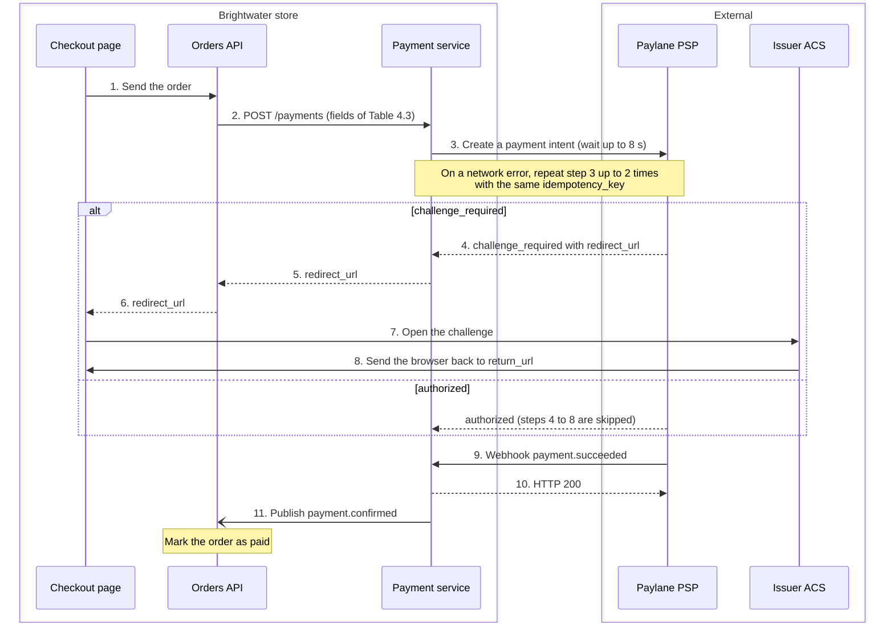

The diagram below shows the steps of §4.2.1. The numbers on the arrows are the step numbers.

```mermaid
sequenceDiagram
    accTitle: Card payment with a 3-D Secure challenge
    accDescr: The Checkout page, the Orders API and the Payment service of the Brightwater store take a card payment through Paylane PSP. When Paylane PSP asks for a challenge, the Checkout page opens it at the Issuer ACS. Paylane PSP then confirms the payment with a webhook.

    box transparent Brightwater store
        participant CP as Checkout page
        participant OA as Orders API
        participant PS as Payment service
    end
    box transparent External
        participant PSP as Paylane PSP
        participant ACS as Issuer ACS
    end

    CP->>OA: 1. Send the order
    OA->>PS: 2. POST /payments (fields of Table 4.3)
    PS->>PSP: 3. Create a payment intent (wait up to 8 s)
    Note over PS,PSP: On a network error, repeat step 3 up to 2 times<br/>with the same idempotency_key
    alt challenge_required
        PSP-->>PS: 4. challenge_required with redirect_url
        PS-->>OA: 5. redirect_url
        OA-->>CP: 6. redirect_url
        CP->>ACS: 7. Open the challenge
        ACS->>CP: 8. Send the browser back to return_url
    else authorized
        PSP-->>PS: authorized (steps 4 to 8 are skipped)
    end
    PSP->>PS: 9. Webhook payment.succeeded
    PS-->>PSP: 10. HTTP 200
    PS-)OA: 11. Publish payment.confirmed
    Note over OA: Mark the order as paid
```