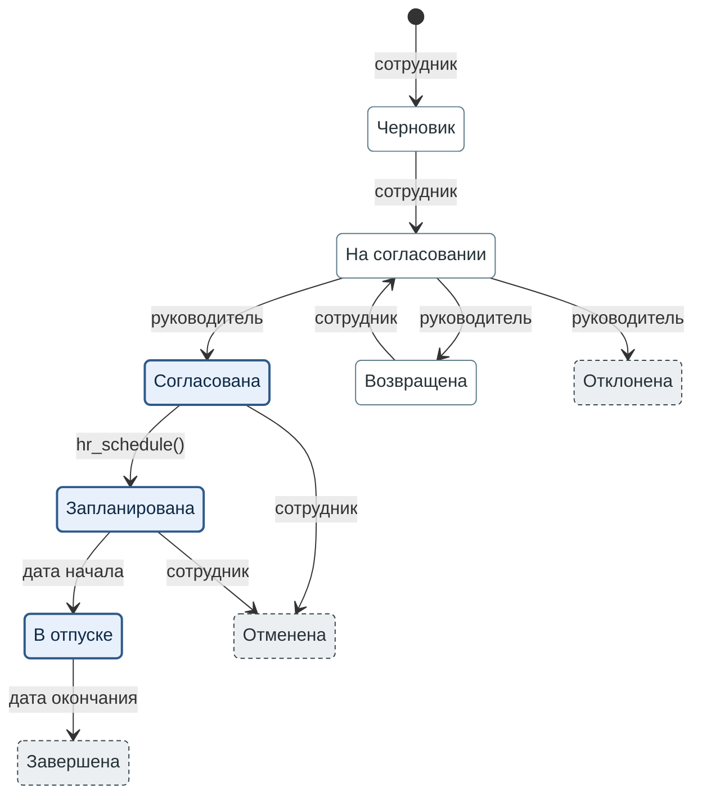

**Рисунок 2.3.** Состояния заявки на отпуск. Каждый переход подписан исполнителем. Где §2.3.1 исполнителя не называет, переход подписан условием.

1. Закрашенный кружок обозначает создание заявки.
2. Толстая синяя рамка и бледно-голубая заливка: дни отпуска зарезервированы («Резерв дней» = да).
3. Тонкая серо-синяя рамка и белая заливка: дни не зарезервированы.
4. Пунктирная тёмно-серая рамка обозначает итоговое состояние. Из него заявка не выходит.
5. Подпись перехода называет его исполнителя. Подписи «дата начала» и «дата окончания» обозначают условия: наступает дата начала или дата окончания отпуска.
6. Запланированную заявку сотрудник отменяет не позднее чем за 2 дня до начала отпуска.
7. На рисунке нет напоминания и эскалации от ночного задания (§2.3.3), потому что они не меняют состояние заявки.