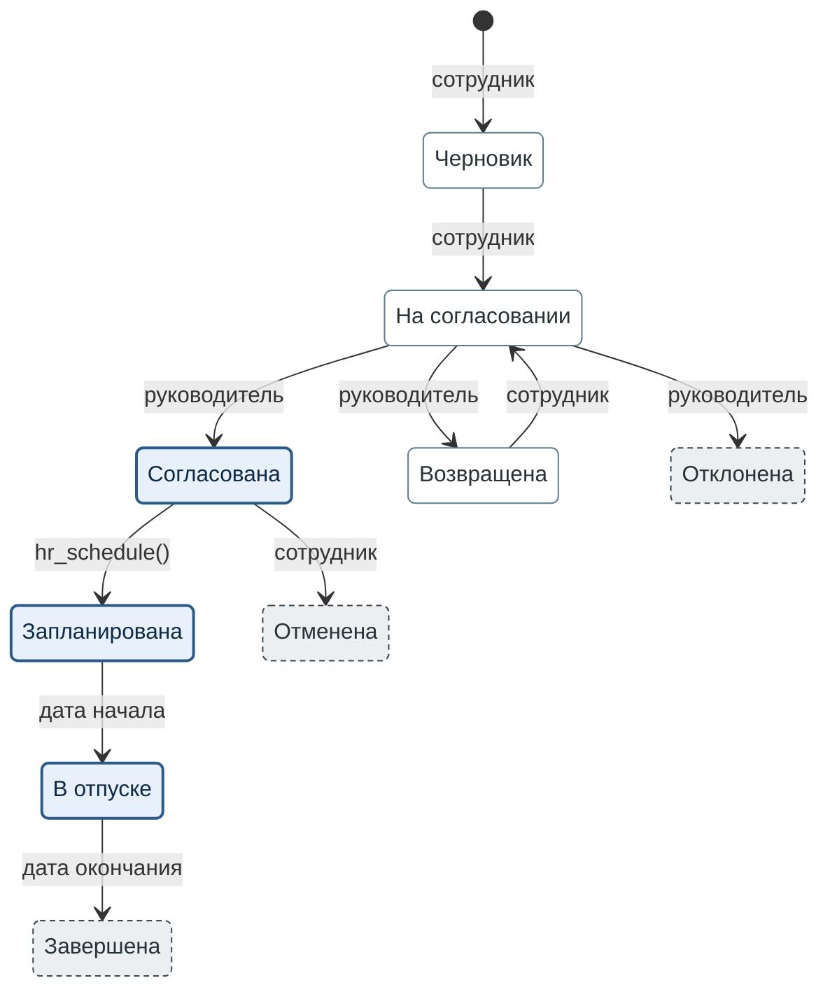

**Рисунок 2.3.** Состояния заявки на отпуск. Каждый переход подписан исполнителем, а где текст исполнителя не называет, условием.

1. Закрашенный кружок обозначает начало: сотрудник создаёт заявку.
2. Толстая синяя рамка с голубой заливкой означает резерв дней: дни отпуска списаны с остатка
   сотрудника.
3. Тонкая серо-голубая рамка с белой заливкой означает, что резерва дней нет.
4. Пунктирная тёмно-серая рамка со светло-серой заливкой обозначает итоговое состояние. Из него
   заявка не выходит.
5. Подпись перехода называет исполнителя так, как его называет текст. `hr_schedule()` — функция
   службы кадров. «дата начала» и «дата окончания» — условия: наступает дата начала или дата
   окончания отпуска.
6. На рисунке не показан один переход: сотрудник отменяет и запланированную заявку, не позднее чем
   за 2 дня до начала отпуска.