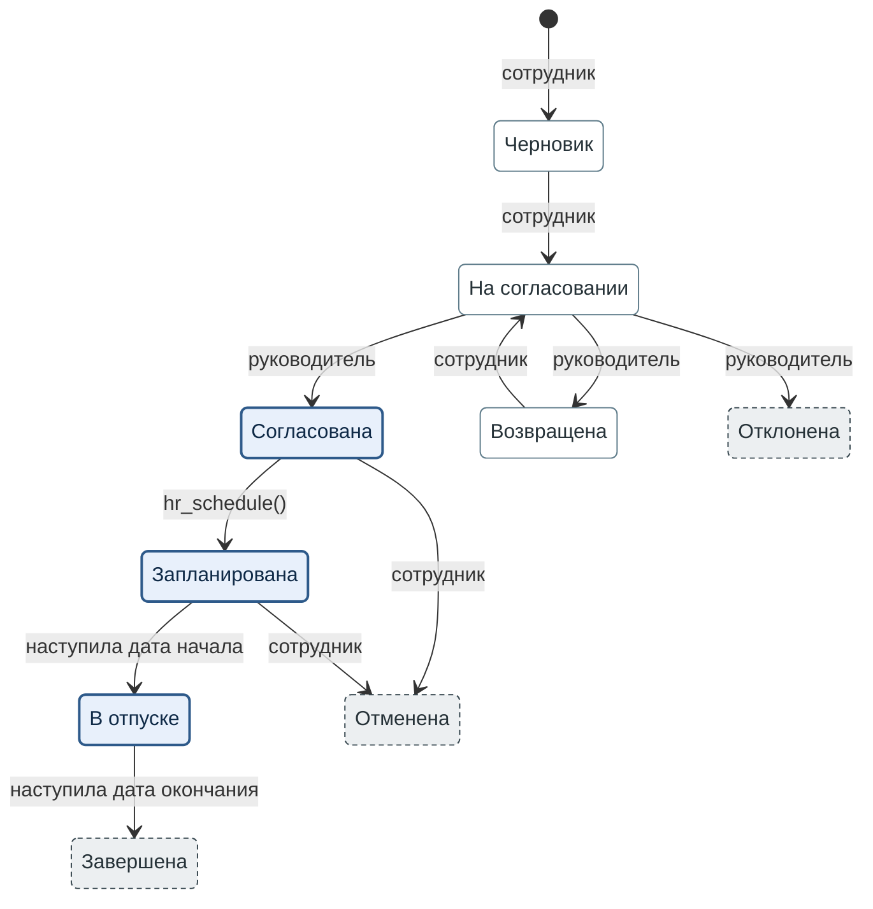

**Рисунок 1.** Состояния заявки на отпуск. Каждый переход подписан исполнителем, а где текст исполнителя не называет, подписан условием.

1. Закрашенный кружок обозначает начало: сотрудник создаёт заявку.
2. Толстая синяя рамка и бледно-голубая заливка обозначают резерв дней: дни отпуска списаны с остатка сотрудника.
3. Тонкая серо-синяя рамка и белая заливка обозначают состояние без резерва дней.
4. Пунктирная тёмно-серая рамка и светло-серая заливка обозначают итоговое состояние. Из него заявка не выходит.
5. Метка перехода называет исполнителя. `hr_schedule()` — функция, которой служба кадров вносит заявку в график. «Наступила дата начала» и «наступила дата окончания» — условия, потому что исполнителя текст не называет.
6. Сотрудник может отменить заявку из «Запланирована» не позднее чем за 2 дня до начала отпуска.