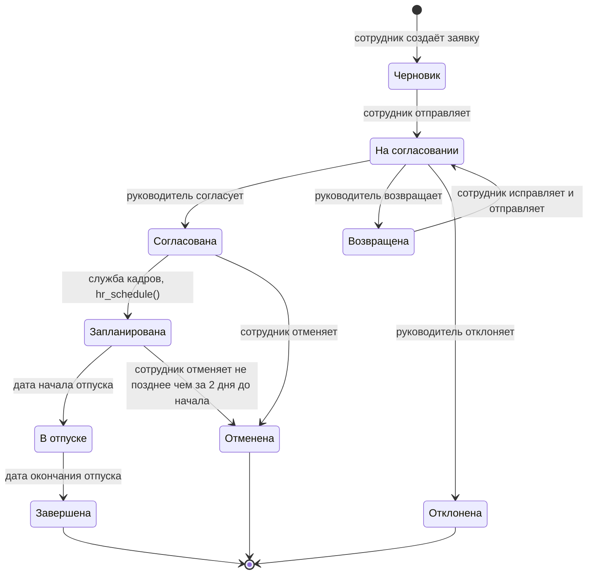

Диаграмма повторяет переходы из 2.3.1. Начальная точка обозначает создание заявки. Конечная точка отмечает итоговые состояния из таблицы 2.3.2.

```mermaid
stateDiagram-v2
    state "Черновик" as Draft
    state "На согласовании" as Review
    state "Возвращена" as Returned
    state "Согласована" as Approved
    state "Запланирована" as Scheduled
    state "В отпуске" as OnLeave
    state "Завершена" as Completed
    state "Отклонена" as Rejected
    state "Отменена" as Cancelled

    [*] --> Draft : сотрудник создаёт заявку
    Draft --> Review : сотрудник отправляет
    Review --> Approved : руководитель согласует
    Review --> Returned : руководитель возвращает
    Review --> Rejected : руководитель отклоняет
    Returned --> Review : сотрудник исправляет и отправляет
    Approved --> Scheduled : служба кадров, hr_schedule()
    Scheduled --> OnLeave : дата начала отпуска
    OnLeave --> Completed : дата окончания отпуска
    Approved --> Cancelled : сотрудник отменяет
    Scheduled --> Cancelled : сотрудник отменяет не позднее чем за 2 дня до начала
    Completed --> [*]
    Rejected --> [*]
    Cancelled --> [*]
```