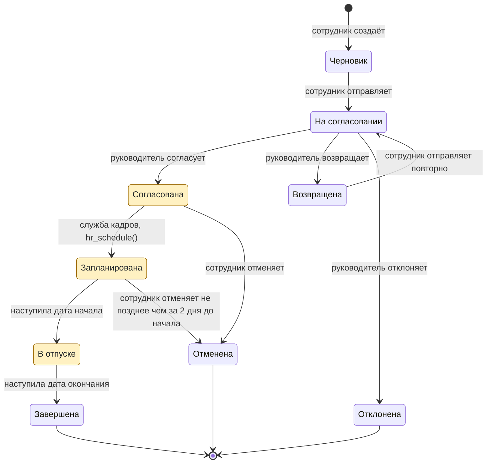

Диаграмма показывает состояния и переходы из разделов 2.3.1 и 2.3.2.

Цветом выделены состояния с резервом дней. Итоговые состояния ведут в конечную точку. Напоминание и эскалация из раздела 2.3.3 не меняют состояние заявки, поэтому на диаграмме их нет.