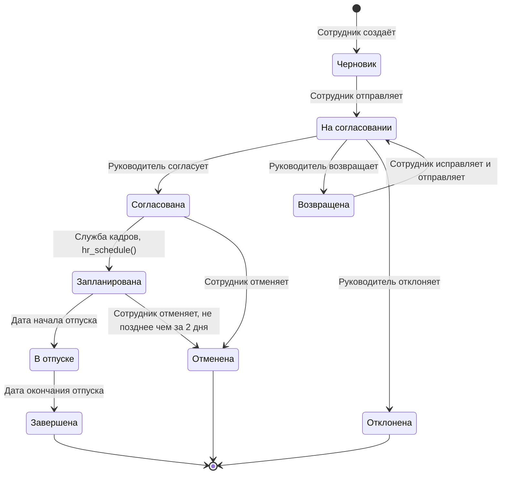

Диаграмма показывает переходы из 2.3.1. Итоговые состояния «Завершена», «Отклонена» и «Отменена» ведут в конечную точку. Уведомления и эскалации из 2.3.3 состояние не меняют, поэтому на диаграмме их нет.

