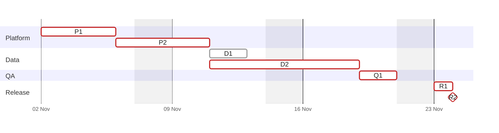

**Figure 1.** Warehouse move schedule: the tasks of §2.1 by team, in working days from 2 November 2026. Each bar carries the task ID of the table in §2.1.

- **Bar:** a task, from its first working day to the end of its last one.
- **Diamond:** R2, the switch of the dashboards when the write freeze ends.
- **Red border:** the critical path of §2.2. D1 has a grey border because it is off the critical path, with 4 working days of slack.
- **Shaded columns:** Saturdays and Sundays, which fall outside every duration.
- **Not drawn:** the 3-day rollback readiness after R2 and the decommissioning tracked in TASK-512.