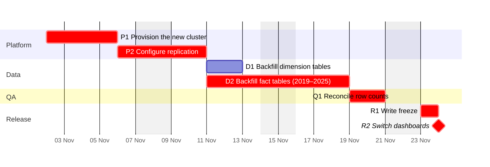

The bars below cover calendar days. Weekends are shaded and do not count towards a task's duration. Critical-path tasks are highlighted. R2 is the diamond at the end of Monday 23 November.

```mermaid
gantt
    accTitle: Schedule for moving the reporting warehouse to the new cluster
    accDescr: P1 runs 2 to 5 Nov, P2 6 to 10 Nov, D1 11 to 12 Nov, D2 11 to 18 Nov, Q1 19 to 20 Nov and R1 on 23 Nov 2026. Milestone R2 is at the end of R1 on 23 Nov. The critical path is P1, P2, D2, Q1, R1 and R2. D1 has 4 working days of slack.
    dateFormat YYYY-MM-DD
    axisFormat %d %b
    excludes weekends

    section Platform
    P1 Provision the new cluster        :crit, p1, 2026-11-02, 4d
    P2 Configure replication            :crit, p2, 2026-11-06, 3d

    section Data
    D1 Backfill dimension tables        :d1, 2026-11-11, 2d
    D2 Backfill fact tables (2019–2025) :crit, d2, 2026-11-11, 6d

    section QA
    Q1 Reconcile row counts             :crit, q1, 2026-11-19, 2d

    section Release
    R1 Write freeze                     :crit, r1, 2026-11-23, 1d
    R2 Switch dashboards                :crit, milestone, r2, 2026-11-24, 0d
```