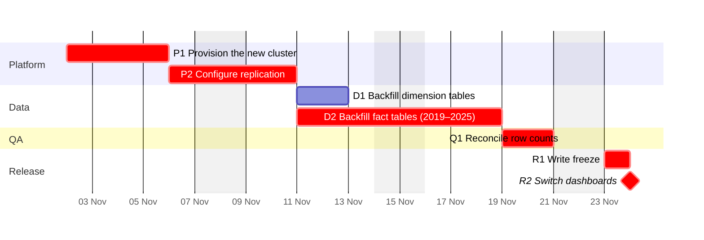

The chart below shows the schedule, with the critical path highlighted. P1 starts on Monday 2 November 2026, and R2 falls at the end of the write freeze on Monday 23 November 2026.

```mermaid
gantt
    accTitle: Reporting warehouse migration schedule
    accDescr: Tasks P1 to R2 from 2 to 23 November 2026, grouped by team, with the critical path P1, P2, D2, Q1, R1 and R2 highlighted
    dateFormat YYYY-MM-DD
    axisFormat %d %b
    excludes weekends
    todayMarker off

    section Platform
    P1 Provision the new cluster        :crit, p1, 2026-11-02, 4d
    P2 Configure replication            :crit, p2, after p1, 3d

    section Data
    D1 Backfill dimension tables        :d1, after p2, 2d
    D2 Backfill fact tables (2019–2025) :crit, d2, after p2, 6d

    section QA
    Q1 Reconcile row counts             :crit, q1, after d1 d2, 2d

    section Release
    R1 Write freeze                     :crit, r1, after q1, 1d
    R2 Switch dashboards                :crit, milestone, r2, after r1, 0d
```