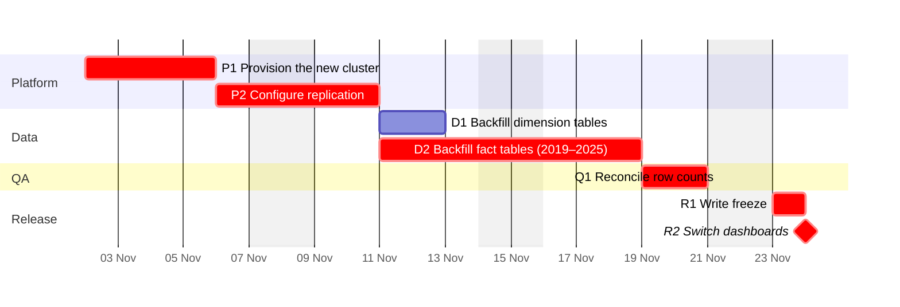

The chart below shows the schedule from §2.1 by team, with the critical path highlighted. The write freeze (R1) falls on Monday 23 November 2026, and the dashboards switch (R2) when that day ends.

