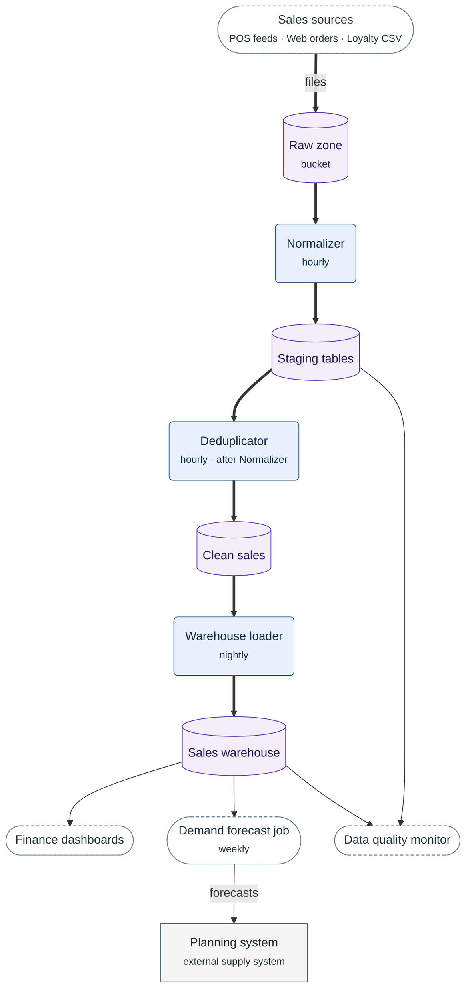

**Figure 5.1.** Sales data flow: how sales data moves from the three sources through the stages of §5.1 to the consumers of §5.2.

Legend:
- every arrow points the way the data moves; thick arrow = the main path of a sales record, from its source to the Sales warehouse; thin arrow = data a consumer reads or writes
- dashed stadium = the three sources, drawn as one node, and the consumers of §5.2
- rounded box = pipeline stage, with when it runs; cylinder = data store; rectangle = external system
- not drawn: the alert of the Data quality monitor to `#sales-data-oncall`