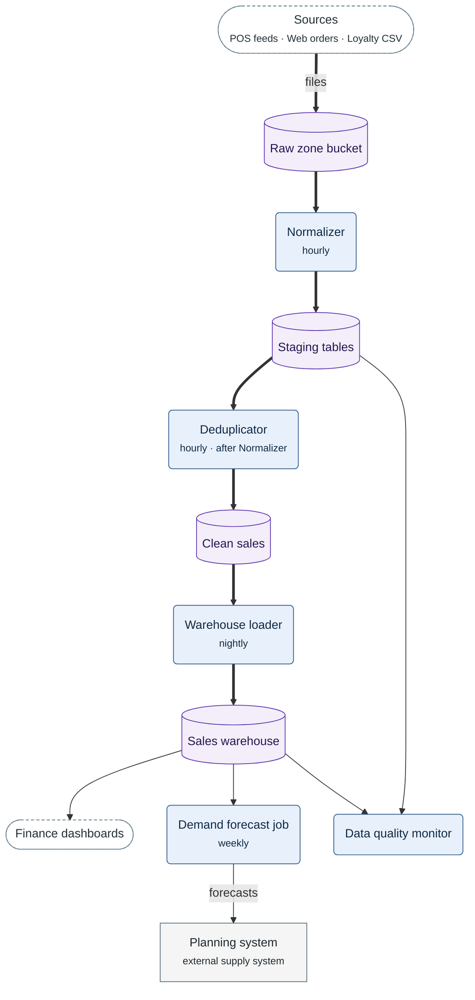

**Figure 5.1.** Sales data flow: the path of a sale from the sources to the Sales warehouse, and what each consumer reads and writes.

Legend:
- every arrow points the way the data moves
- thick arrow = the path of a sale to the Sales warehouse; thin arrow = a consumer's read or write
- dashed stadium = the sources and the Finance dashboards; rectangle = external system
- rounded box = a stage or a consumer job; its second line = when it runs
- cylinder = a store
- not drawn: the alert the Data quality monitor sends to `#sales-data-oncall`