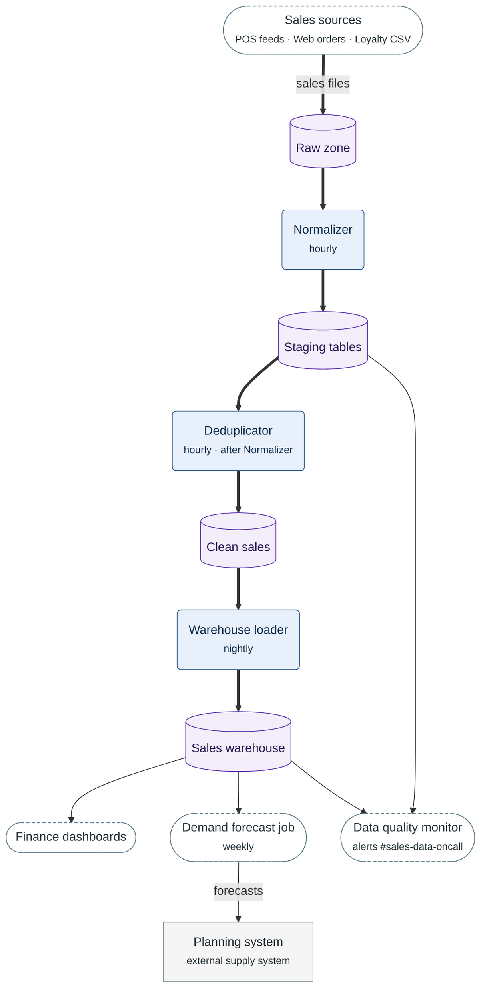

**Figure 5.1.** Sales data flow: how a sales record moves from the sources to the Sales warehouse, and what the consumers read.

Legend:
- every arrow points the way the data moves
- thick arrow = the main path of a sales record; thin arrow = other data
- dashed stadium = the sources at the top, or a consumer below the warehouse
- rounded box = pipeline stage, with when it runs
- cylinder = bucket or table; rectangle = external system
- Sales sources stands for the three sources of the table above; each drops its own files into Raw zone