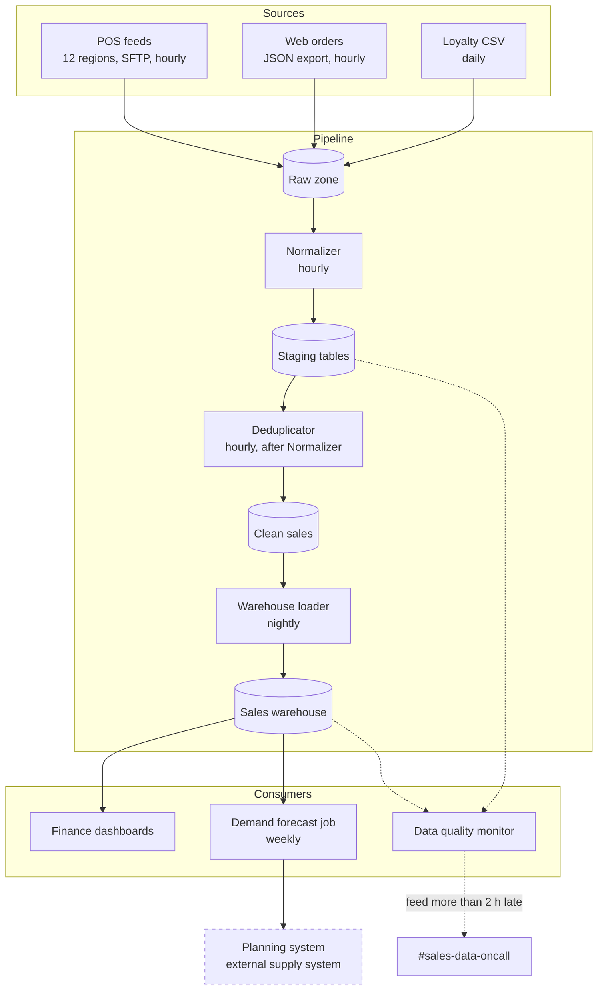

The diagram below shows how sales data moves from the sources to the consumers. Cylinders are data stores. Solid arrows carry sales data. Dashed arrows are the reads and alerts of the Data quality monitor.

