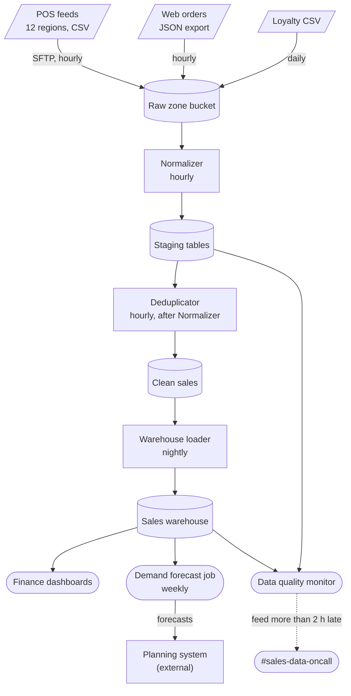

The figure shows how sales data moves from the sources through the stages to the consumers of §5.2.

```mermaid
flowchart TB
    accTitle: Sales data flow
    accDescr: POS feeds, web orders and the loyalty CSV land in the Raw zone bucket. The Normalizer, the Deduplicator and the Warehouse loader move the data through Staging tables and Clean sales into the Sales warehouse. Finance dashboards, the Demand forecast job and the Data quality monitor read the results. The Demand forecast job writes to the external Planning system, and the Data quality monitor alerts the on-call channel.

    pos[/"POS feeds<br>12 regions, CSV"/]
    web[/"Web orders<br>JSON export"/]
    loyalty[/"Loyalty CSV"/]

    raw[("Raw zone bucket")]
    normalizer["Normalizer<br>hourly"]
    staging[("Staging tables")]
    dedup["Deduplicator<br>hourly, after Normalizer"]
    clean[("Clean sales")]
    loader["Warehouse loader<br>nightly"]
    warehouse[("Sales warehouse")]

    finance(["Finance dashboards"])
    forecast(["Demand forecast job<br>weekly"])
    planning["Planning system<br>(external)"]
    dq(["Data quality monitor"])
    oncall(["#sales-data-oncall"])

    pos -->|"SFTP, hourly"| raw
    web -->|"hourly"| raw
    loyalty -->|"daily"| raw

    raw --> normalizer
    normalizer --> staging
    staging --> dedup
    dedup --> clean
    clean --> loader
    loader --> warehouse

    warehouse --> finance
    warehouse --> forecast
    forecast -->|"forecasts"| planning
    staging --> dq
    warehouse --> dq
    dq -.->|"feed more than 2 h late"| oncall
```
