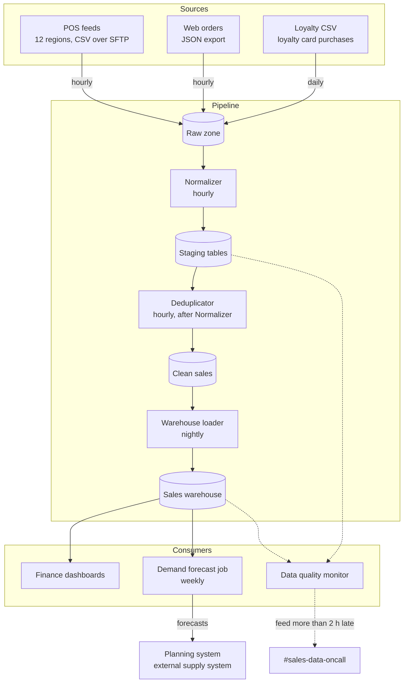

The figure below shows how sales data moves from the three sources, through the pipeline stages, to the consumers listed in §5.2. Cylinders are data stores. Dashed arrows are the Data quality monitor's reads and its alert.

