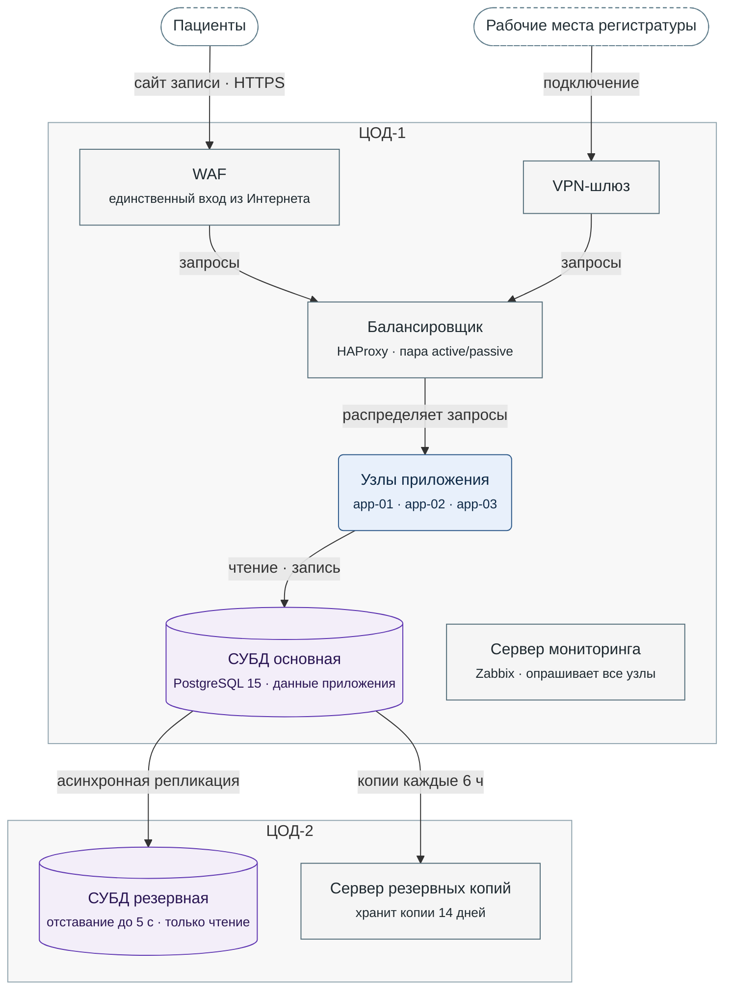

**Рисунок 4.1.** Развёртывание МедЗаписи: все узлы основного ЦОД-1 и резервного ЦОД-2, путь запросов пациентов и регистратуры до СУБД основной, её репликация и резервные копии.

Условные обозначения:
- овал с пунктирной рамкой — вне системы: пациенты и рабочие места регистратуры
- прямоугольник — шлюз, балансировщик или служебный сервер; скруглённый прямоугольник — узлы приложения; цилиндр — СУБД
- серая рамка — ЦОД
- стрелка — запросы или поток данных, от отправителя к получателю
- не показано: опрос всех узлов обоих ЦОД сервером мониторинга; ручное продвижение СУБД резервной и переключение DNS при отказе ЦОД-1 (§4.3)