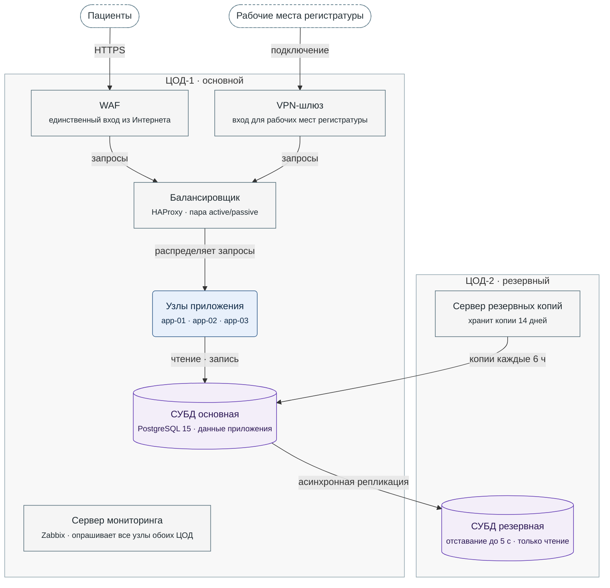

**Рисунок 4.1.** Развёртывание МедЗаписи: узлы обоих ЦОД, путь запроса от пациентов и регистратуры до СУБД основной, репликация и снятие резервных копий.

Легенда:
- овал со штриховой рамкой: пользователи вне системы; прямоугольник: инфраструктурный узел;
- скруглённый блок: узлы приложения; цилиндр: СУБД;
- серая рамка: ЦОД;
- стрелка: обращение от того, кто его начинает; у репликации стрелка идёт от основной СУБД к резервной;
- не нарисованы: опрос всех узлов сервером мониторинга (он указан во второй строке узла) и ручное переключение при отказе ЦОД-1 (§4.3).