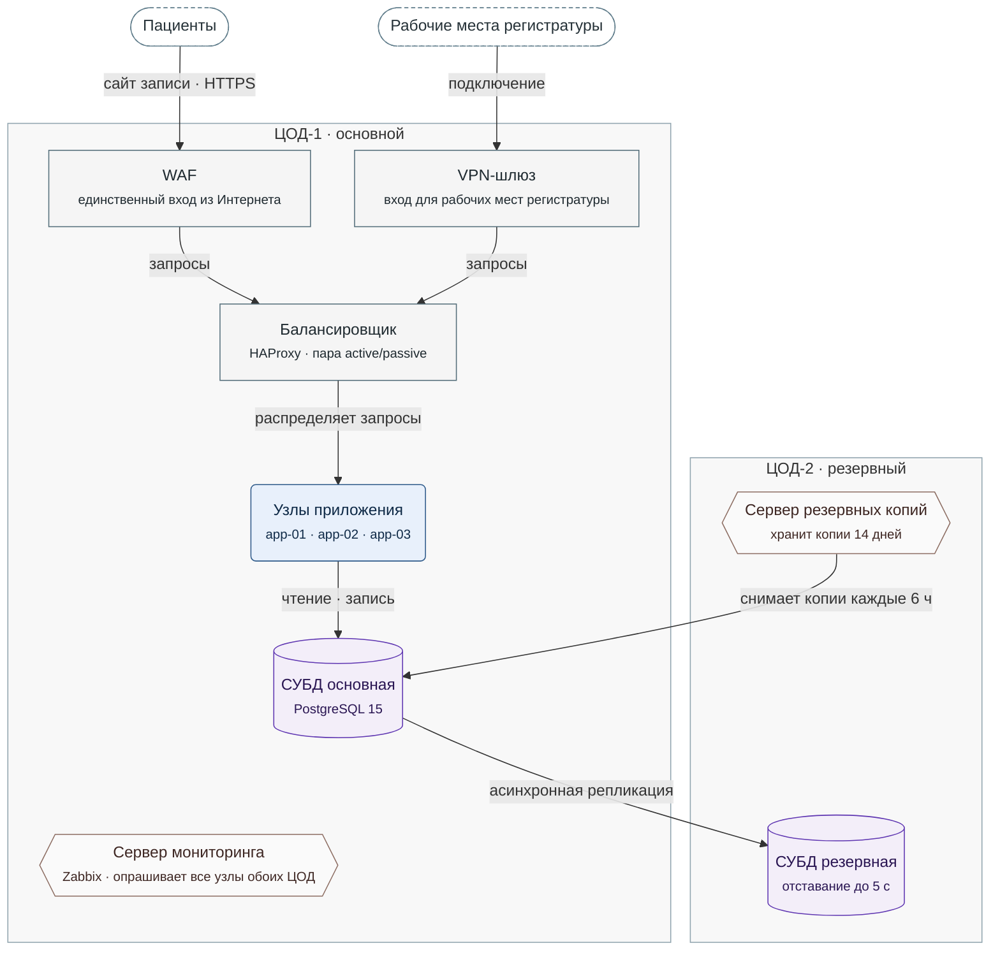

**Рисунок 4.1.** Развёртывание МедЗаписи: узлы ЦОД-1 и ЦОД-2, путь запросов от пациентов и регистратуры до СУБД основной, репликация и резервные копии.

Легенда:
- овал с пунктирной рамкой = вне системы: пациенты и рабочие места регистратуры
- прямоугольник = сетевой узел; скруглённый блок = узлы приложения
- цилиндр = СУБД; шестиугольник = сервер мониторинга или резервных копий
- серая рамка = центр обработки данных
- стрелка = действие из подписи, от узла, который его выполняет; репликация идёт от СУБД основной к резервной
- не нарисованы: опрос всех узлов сервером мониторинга (он указан на самом узле) и ручное переключение при отказе ЦОД-1 (§4.3)