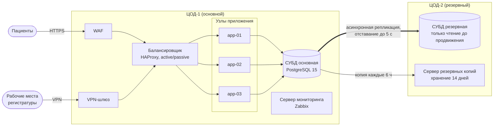

### 4.4 Схема развёртывания

Пациенты и рабочие места регистратуры — внешние клиенты, а не узлы системы.
Жирная стрелка обозначает репликацию между ЦОД.
Сервер мониторинга опрашивает все узлы обоих ЦОД. Чтобы не загромождать схему, связи опроса на ней не показаны.
Ручное переключение при отказе ЦОД-1 описано в 4.3.