```mermaid
flowchart TB
    P(["Пациенты"])
    R(["Рабочие места<br/>регистратуры"])

    subgraph DC1["ЦОД-1 (основной)"]
        WAF["WAF"]
        VPN["VPN-шлюз"]
        LB["Балансировщик HAProxy<br/>пара active/passive"]
        APP["Узлы приложения<br/>app-01, app-02, app-03<br/>без состояния"]
        PG1[("СУБД основная<br/>PostgreSQL 15")]
        MON["Сервер мониторинга<br/>Zabbix"]
    end

    subgraph DC2["ЦОД-2 (резервный)"]
        PG2[("СУБД резервная<br/>только чтение")]
        BK["Сервер резервных копий<br/>хранение 14 дней"]
    end

    P -->|"HTTPS"| WAF
    R -->|"VPN"| VPN
    WAF --> LB
    VPN --> LB
    LB --> APP
    APP -->|"чтение и запись"| PG1
    PG1 -.->|"асинхронная репликация, до 5 с"| PG2
    PG1 -.->|"копия каждые 6 ч"| BK
```

На схеме показана работа в штатном режиме. Сплошные стрелки обозначают запросы, а пунктирные — копирование данных. Пациенты и рабочие места регистратуры являются клиентами и не входят в число узлов системы. Сервер мониторинга опрашивает все узлы обоих ЦОД, но эти связи на схеме не показаны. Порядок действий при отказе ЦОД-1 описан в §4.3.