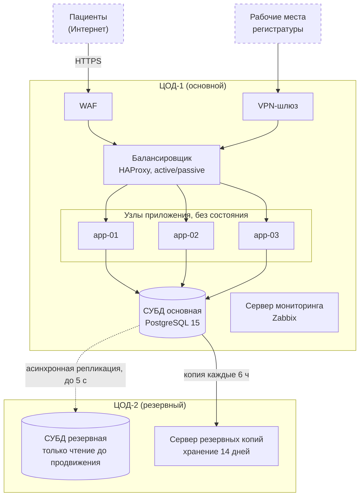

Схема показывает узлы обоих ЦОД и связи между ними.
Пунктирной рамкой отмечены внешние участники; они не входят в число узлов системы.
Сервер мониторинга опрашивает все узлы обоих ЦОД; эти связи на схеме не показаны.

