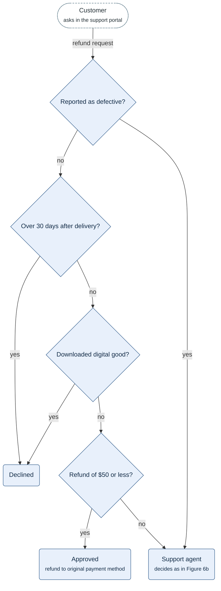
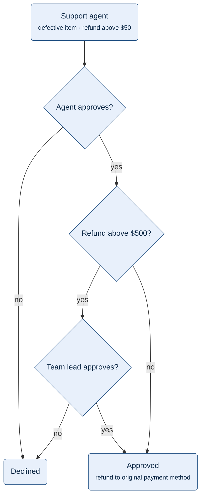

**Figure 6a.** Refund checks: the checks R6.1, R6.2 and R6.3 in the order they run, and where each answer leads.

Legend:
- dashed stadium = the customer who asks for the refund
- diamond = a check, top to bottom in the order they run: the first two are R6.1, then R6.2, then R6.3
- rounded box = an outcome; arrow label = the answer that leads to the next box
- not drawn: the record of each decision in the history of the request, and the limits of §6.2

**Figure 6b.** Review by people: a request that goes to a support agent, the agent's decision, and the team lead's decision above $500 (R6.4, R6.5, R6.6).

Legend:
- rounded box at the top = the request at a support agent, from Figure 6a; rounded boxes below = outcomes
- diamond = a decision, top to bottom in the order it happens; arrow label = the answer that leads to the next box