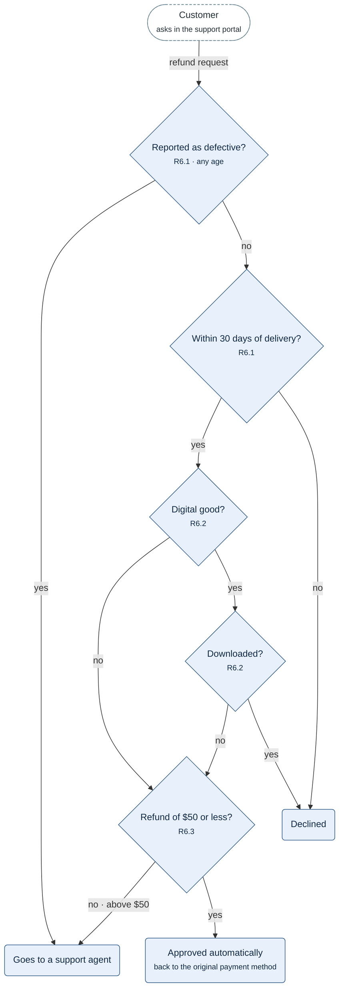
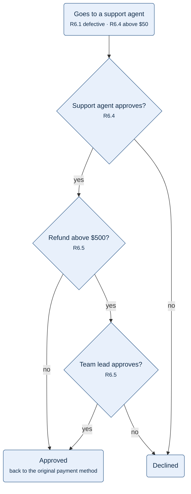

**Figure 6.1.** Refund checks: R6.1, R6.2 and R6.3 in the order they run, and the three outcomes they lead to.

Legend:
- dashed stadium = the customer
- diamond = a check, top to bottom in the order R6.1, R6.2, R6.3; its second line names the rule
- rounded box = an outcome; "Goes to a support agent" continues in Figure 6.2
- arrow = the next step; its label = the answer that leads to it

The defect report is checked before the age because R6.1 sends a defective item to a support agent at any age. R6.2 applies to digital goods only, so any other good goes straight to R6.3.

**Figure 6.2.** Refund review: the decision of the support agent and, above $500, the decision of a team lead.

Legend:
- rounded box at the top = the outcome of Figure 6.1 that this review starts from; other rounded boxes = outcomes
- diamond = a decision or a check, top to bottom in the order R6.4, R6.5; its second line names the rule
- arrow = the next step; its label = the answer that leads to it
- not drawn: the record of every decision in the history of the request, and the limits of §6.2, which do not change the decision