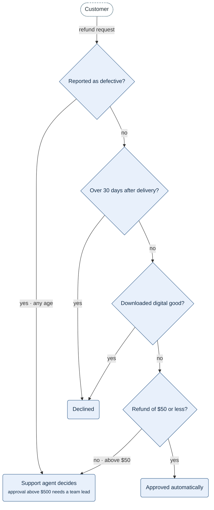

**Figure 6.1.** Refund decision: the checks of R6.1, R6.2 and R6.3 in the order they run, and the three results they lead to.

Legend:
- diamond = a check, run top to bottom: R6.1 as two checks, then R6.2, then R6.3
- rounded box = a result of the checks; dashed stadium = the customer
- arrow label = the answer that leads to the next box
- not drawn: the payout of R6.6 and the limits of §6.2