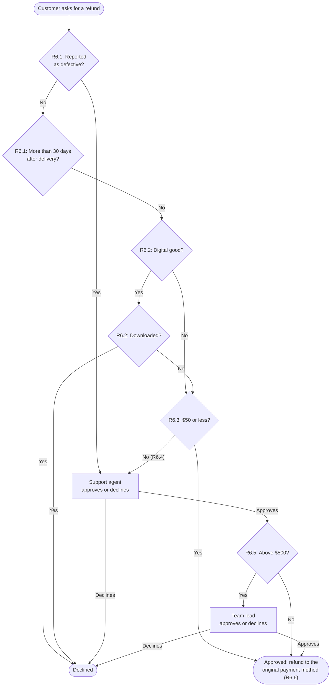

Figure 6.1 shows how a refund request is decided. The rules in §6.1 govern if the figure and the rules differ.

```mermaid
flowchart TD
    accTitle: Refund decision
    accDescr: Decision flow for a refund request, following rules R6.1 to R6.6.

    request(["Customer asks for a refund"]) --> defective{"R6.1: Reported<br/>as defective?"}
    defective -->|Yes| agent["Support agent<br/>approves or declines"]
    defective -->|No| age{"R6.1: More than 30 days<br/>after delivery?"}
    age -->|Yes| declined(["Declined"])
    age -->|No| digital{"R6.2: Digital good?"}
    digital -->|Yes| downloaded{"R6.2: Downloaded?"}
    digital -->|No| amount{"R6.3: $50 or less?"}
    downloaded -->|Yes| declined
    downloaded -->|No| amount
    amount -->|Yes| approved(["Approved: refund to the<br/>original payment method (R6.6)"])
    amount -->|"No (R6.4)"| agent
    agent -->|Declines| declined
    agent -->|Approves| large{"R6.5: Above $500?"}
    large -->|No| approved
    large -->|Yes| lead["Team lead<br/>approves or declines"]
    lead -->|Declines| declined
    lead -->|Approves| approved
```

*Figure 6.1: Refund decision*