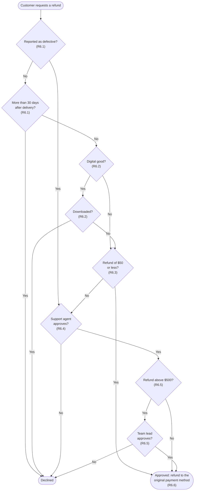

Figure 6.1 shows how the rules of §6.1 decide a refund request. The support portal records each decision in the history of the request.

```mermaid
flowchart TD
    accTitle: Refund decision flow
    accDescr: The checks R6.1, R6.2 and R6.3 run in order. A request ends as declined or as approved, and an approved refund goes back to the original payment method.

    request(["Customer requests a refund"])
    defective{"Reported as defective?<br/>(R6.1)"}
    age{"More than 30 days<br/>after delivery?<br/>(R6.1)"}
    digital{"Digital good?<br/>(R6.2)"}
    downloaded{"Downloaded?<br/>(R6.2)"}
    amount{"Refund of $50<br/>or less?<br/>(R6.3)"}
    agent{"Support agent<br/>approves?<br/>(R6.4)"}
    large{"Refund above $500?<br/>(R6.5)"}
    lead{"Team lead<br/>approves?<br/>(R6.5)"}
    declined(["Declined"])
    approved(["Approved: refund to the<br/>original payment method<br/>(R6.6)"])

    request --> defective
    defective -- Yes --> agent
    defective -- No --> age
    age -- Yes --> declined
    age -- No --> digital
    digital -- Yes --> downloaded
    digital -- No --> amount
    downloaded -- Yes --> declined
    downloaded -- No --> amount
    amount -- Yes --> approved
    amount -- No --> agent
    agent -- No --> declined
    agent -- Yes --> large
    large -- No --> approved
    large -- Yes --> lead
    lead -- No --> declined
    lead -- Yes --> approved
```