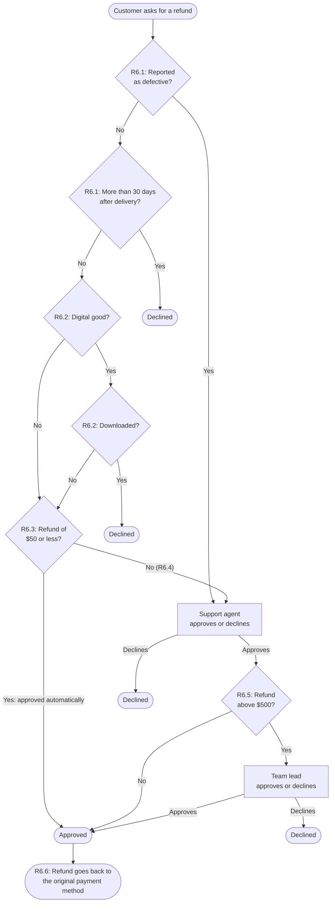

The figure below shows how the rules of §6.1 decide a refund request.

```mermaid
flowchart TD
    accTitle: Refund decision flow
    accDescr: The checks R6.1, R6.2 and R6.3 run in order. A defective item or a larger refund goes to a support agent, and a large refund that the agent approves also needs a team lead. An approved refund goes back to the original payment method.

    request(["Customer asks for a refund"])
    defective{"R6.1: Reported<br/>as defective?"}
    age{"R6.1: More than 30 days<br/>after delivery?"}
    digital{"R6.2: Digital good?"}
    downloaded{"R6.2: Downloaded?"}
    amount{"R6.3: Refund of<br/>$50 or less?"}
    agent["Support agent<br/>approves or declines"]
    large{"R6.5: Refund<br/>above $500?"}
    lead["Team lead<br/>approves or declines"]
    approved(["Approved"])
    refund(["R6.6: Refund goes back to<br/>the original payment method"])
    declinedAge(["Declined"])
    declinedDownload(["Declined"])
    declinedAgent(["Declined"])
    declinedLead(["Declined"])

    request --> defective
    defective -->|Yes| agent
    defective -->|No| age
    age -->|Yes| declinedAge
    age -->|No| digital
    digital -->|Yes| downloaded
    digital -->|No| amount
    downloaded -->|Yes| declinedDownload
    downloaded -->|No| amount
    amount -->|"Yes: approved automatically"| approved
    amount -->|"No (R6.4)"| agent
    agent -->|Declines| declinedAgent
    agent -->|Approves| large
    large -->|No| approved
    large -->|Yes| lead
    lead -->|Approves| approved
    lead -->|Declines| declinedLead
    approved --> refund
```