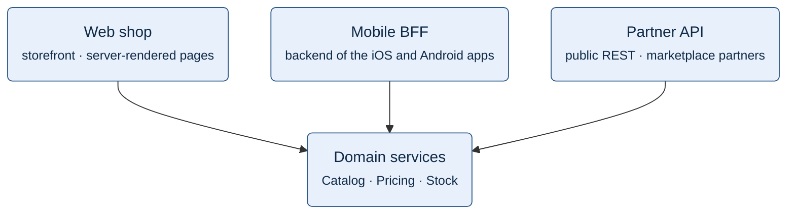

**Figure 2.4.** Front-end calls: each front-end calls each of the three domain services.

Legend:
- rounded box in the top row = a front-end. The box below stands for Catalog service, Pricing service and Stock service, drawn as one node.
- arrow = the front-end calls each of the three services directly over HTTP/JSON. No API gateway sits between them (FS-1, FS-2, decision D-7).
- not drawn: the calls from Stock service to Pricing service (FS-3), the Admin console (FS-4) and the Warehouse feed (FS-5).