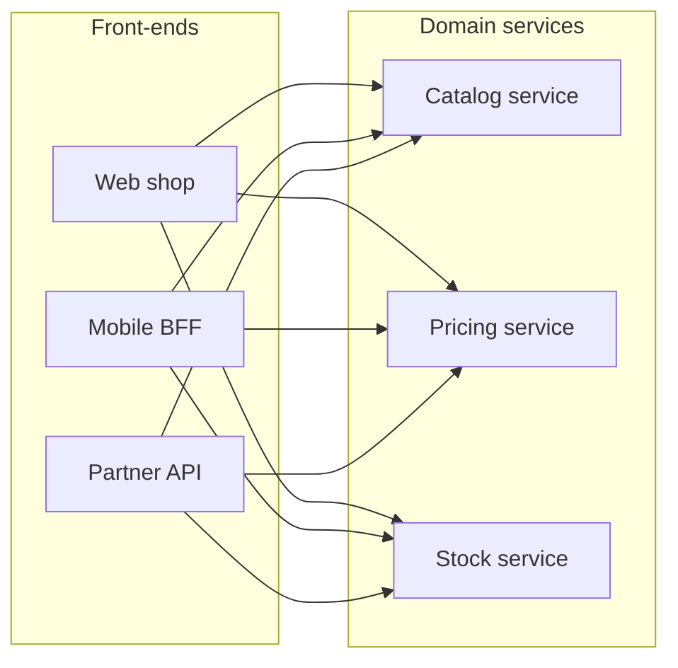

*Figure 2.4 — Front-end calls to domain services.* Each front-end calls each domain service directly over HTTP/JSON, with no API gateway between them (FS-1, FS-2). The figure leaves out Stock service's calls to Pricing service (FS-3), the Admin console (FS-4) and the Warehouse feed (FS-5).