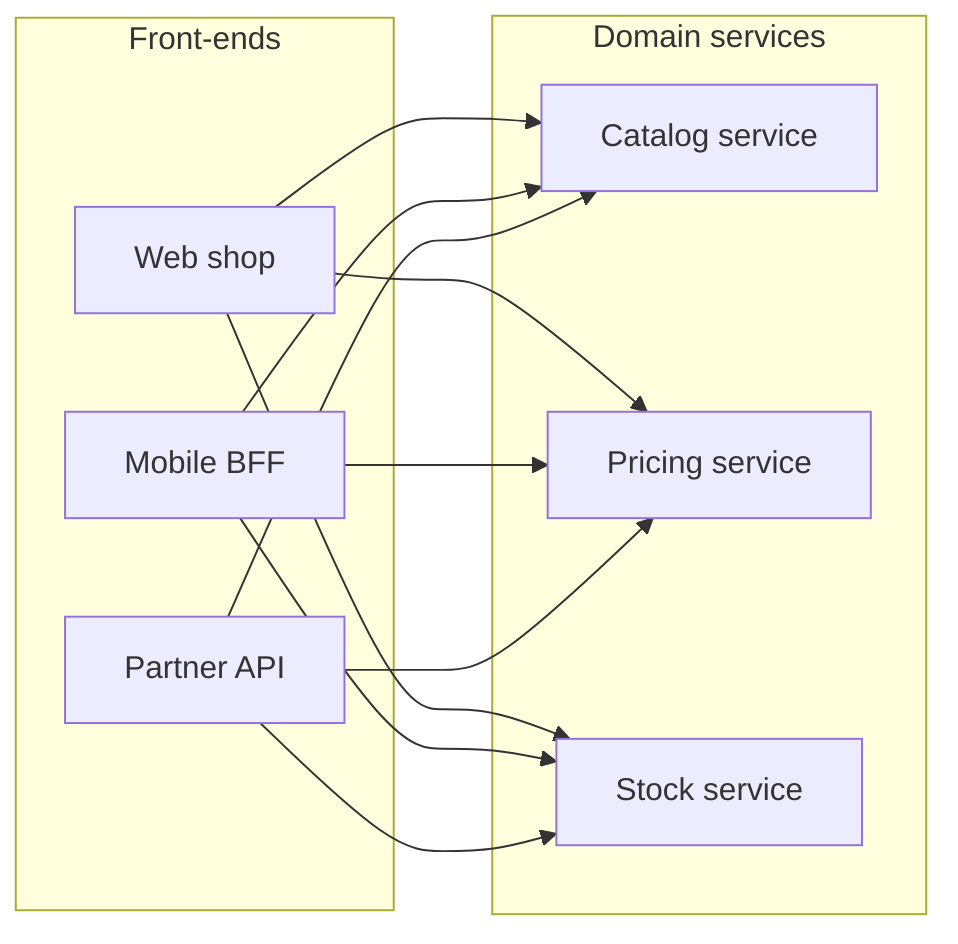

*Figure 2.4: Calls from the front-ends to the domain services (FS-1). Each arrow is a direct HTTP/JSON call, and no API gateway sits between them (FS-2). The figure leaves out Stock service → Pricing service (FS-3), the Admin console (FS-4) and the Warehouse feed (FS-5).*